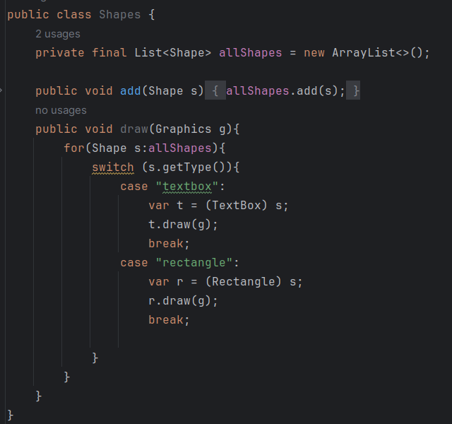
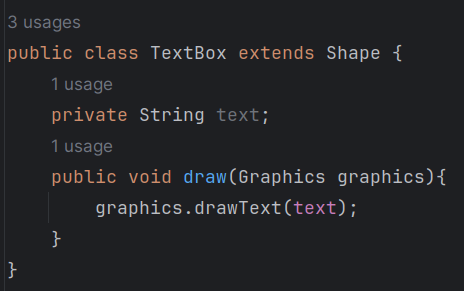
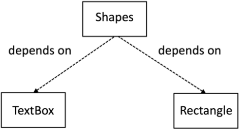
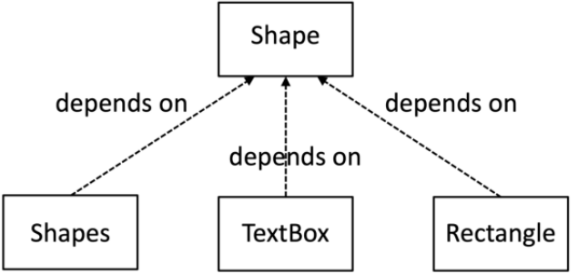

# TAREAS

### ejercicio 1

**Codigo Inicial:**

Vamos a refactorizar el codigo para que la clase Rectangle y TextBox tengan una unica responsabilidad.

En este caso estamos delegando la implementacion del dibujo a cada una de estas clases mediante el metodo draw, es decir, cada una tiene su propia responsabilidad de dibujar.

Ademas podemos ver que la clase Rectangle y TextBox tienen una unica responsabilidad, la de implementar su dibujo:

### ejercicio 2

**Codigo Inicial:**

Podemos aprenciar la dependencia de la clase Shapes con TextBox y Rectangle.

Ahora podemos ver que la clase Shapes depende directamente de la interfaz Shape y no de todas sus posibles implementaciones, esto satisface el principio de inversion de dependencias que nos dice  **"depende de abstracciones, no de detalles".**

Podemos ver ahora la nueva dependencia entre estas clases

- **Consumidores:** Shapes (clases que usan Shape)
- **Proveedores:** TextBox y Rectangle (clases que implementan)

### ejercicio 3

**Codigo Inicial:**

Aseguremenos que se respete el LSP y se pueda sustituir Rectangle y TextBox sin problemas.

Como podemos ver, el metodo draw implementado por Circle se comporta de la misma manera que las otras dos clases, TextBox y Rectangle.

### ejercicio 4

### ejercicio 5

**Codigo inicial**

Nos piden implementar Strategy Pattern para manejar el dibujo de diferentes tipos de formas. 

Veamos con implementar el patron Strategy

**Referencia : Sumergete en los patrones de diseno Alexander Shev**

