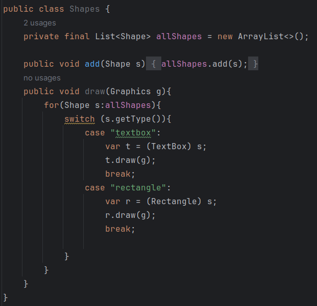

# Principios SOLID

Los principios SOLID son 5 pautas que orientan los disenos para que sean mas flexibles y modulares. Estos principios se aplican igualmente a los metodos individuales de una clase, como a la clase misma. Tambien se aplican al diseno de **interconexiones de microservicios**.

Trabajaremos con este diagrama UML.

### SRP (Principio de responsabilidad unica)

BLOQUES DE CONSTRUCCION SIMPLE

En esta seccion, examinaremos el primer principio conocido como SRP.

- Nos guia para dividir el codigo en partes que encapsulen un solo aspecto de la solucion.
- Cada fragmento de codigo es responsable de un unico detalle.
- Una pieza de codigo debe tener una razon para cambiar.
- Haz una cosa y hazla bien

Veamos un contraejemplo y como solucionarlo:

**Analisis:**
    Podemos ver que este codigo tiene 4 responsabilidades

- Administrar la lista de formas con el metodo add()
- Dibujar todas las formas en la lista con el metodo draw()
- Conocer cada tipo de forma en la declaracion switch
- Tiene detalles de implementacion para dibujar cada tipo de forma en las declaraciones case.

**Problema:**
 - Si queremos agregar un nuevo tipo de forma como un triangulo, entonces necesitaremos cambiar este codigo e implementar el metodo draw, agregar un nuevo case, implementar el dibujo de triangulo haciendo el codigo mas grande, complejo y en consecuencia mas dificil de leer y mas propenso a errores.

 - Cada prueba debe probar solo una cosa. Esto hace que sea mas facil de localizar cualquier falla. Encontramos la prueba que fallo, y debido a que se trata de un solo aspecto de nuestro codigo, es facil encontrar el codigo donde debe estar el defecto. La recomendacion de tener solo una asercion para cada prueba fluye naturalmente de esto.

**Solucion:**
- Aplicaremos SRP para simplificar el mantenimiento futuro.

Podemos ver que en esta refactorizacion, el codigo tiene 1 responsabilidad menos, la de **implementar la logica dibujar** cada tipo de forma.

Ademas podemos ver que la clase Rectangle y TextBox tienen una unica responsabilidad, la de implementar su dibujo:

**Implicaciones**

- Clase Rectangle y TextBox tienen una unica responsabilidad (implementar su dibujo).
- La clase Shapes tiene 1 responsabilidad menos.

### DIP (Principio de inversion de dependencia) 

OCULTAR DETALLES IRRELEVANTES

En esta seccion, aprenderemos como el DIP nos permite dividir el codigo en componentes separados que pueden cambiar independientemente unos de otros y luego veremos como esto conduce naturalmente a la parte OCP de SOLID.

**Escribimos codigo para depender de abstracciones, no de detalles**, la otra cara de esto seria tener dos bloques en la que la implementacion de uno, dependa de la implementacion del otro, por lo que los cambios en uno provocaran cambios en otro.

Habiamos dejado a la clase Shapes de esta forma:

**Problemas**

- El codigo Shapes cambiara al agregar una nueva clase para dibujar.

- Cualquier cambio en una de las clases como Rectangle afectara a la clase Shapes.

- La clase shapes se hara mas larga y menos facil de leer.

- Terminaremos con mas casos de prueba en donde cada caso de prueba se acoplara a clases concretas como Rectangle.

- Viola SRP al conocer demasiado sobre cada tipo de forma.

- La **inestabilidad** de esta clase se hara mas grande.

**Analisis:**

Este codigo funciona bien para mantener una lista de objetos Shape y dibujarlos. Pero si queremos agregar un nuevo tipo de forma que queremos dibujar entonces tambien debemos cambiar el codigo. Esto quiere decir que la clase Shapes depende directamente de TextBox, Rectangle y todas las nuevas clases que se quieran dibujar.

**Solucion**

Al parecer el problema se da porque la clase Shapes depende de cada clase que dibuja, por lo que la idea estaria en crear una interfaz en donde cada clase que dibuja dependa de esa interfaz y la clase Shapes dependa, a su vez, unicamente de esta interfaz.
A esto es lo que se conce como DIP.

Shape vendria a ser la interfaz:

Y las clases que implementan esa interfaz y escriben el metodo draw serian TextBox y Rectangle:

Por lo que podemos ver que ahora el codigo Shapes solo depende de Shape, que es una interfaz y no depende de las implementaciones de esta, lo cual satisface el prinicpio de DIP, **"depende de abstracciones, no de detalles".**

Presentamos el siguiente diagrama:

- Shapes es un consumidor de la clase Shape
- TextoBox y Rectangle son proveedores de la clase Shape

**Nota:**

Cabe Resaltar que aqui tambien cumplimos el segundo principio solid, principio OO (Open-Closed), este principio nos dice que una clase debe estar cerrada para su modificacion pero abierta para su extension. 

Shapes no se modificaria si queremos agregar mas tipos de formas, es decir, esta cerrada para su modificacion, sinembargo podemos crear una nueva clase que implemente a Shape y asi extender los tipos de formas existentes, es decir, esta abierta para su extension.

## LSP (Principio de sustitucion de Liskov)

Este principio se basa en la siguiente pregunta:

**podemos extender una clase y usarla en lugar de la clase que extendimos, ¿cómo podemos estar seguros de que la nueva clase no romperá las cosas?**

Hemos visto en la sección anterior sobre DIP cómo podemos usar cualquier clase que implemente una interfaz en lugar de la interfaz misma.
La interfaz en sí no ofrece ninguna garantía sobre lo que podría esconderse dentro de ese código de implementación. 

Veamos el siguiente ejemplo:

Una interfaz en Java solo puede proteger la sintaxis de las llamadas a métodos que esperamos. No puede imponer ninguna semántica. El problema con la clase MaliciousShape anterior es que no respeta la intención detrás de la interfaz.

**Definicion formal del uso de LSP**

Un bloque de código se puede intercambiar con seguridad por otro si puede manejar la gama completa de entradas y proporcionar (al menos) todas las salidas esperadas, sin efectos secundarios no deseados. 

Todas las clases que implementan Shape se ajustan a LSP. Esto es claro en la clase TextBox, como podemos ver aquí: 

El objetivo de LSP es hacer que las clases se ajusten adecuadamente a las interfaces. En la siguiente sección, veremos OCP, que está estrechamente relacionado con DI. 

## OCP (Principio abierto y cerrado)

DISEÑO EXTENSIBLE

Ayuda a agregar nuevas funciones perio sin cambiar el codigo en si. Esto suena como una imposibilidad,pero se da de la combinacion de DIP con LSP.

