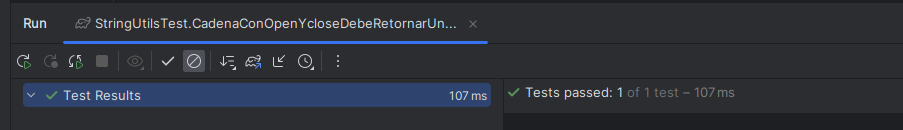
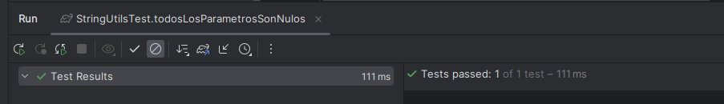
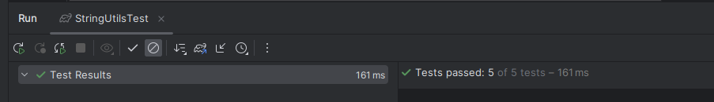
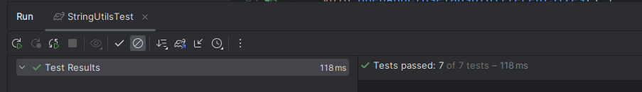
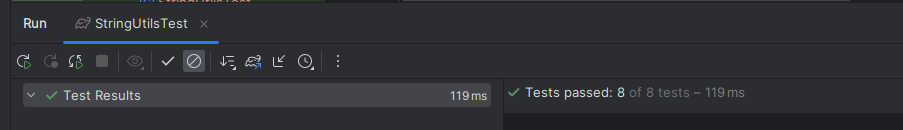
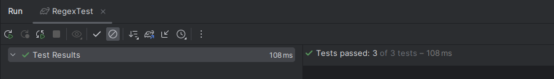

``` java
public class StringUtils {

    // Este metodo verifica si la cadena es nula o vacia
    private static boolean isEmpty(final String str) {
        return str == null || str.isEmpty();
    }

    // Metodo que obtiene todas las cadenas que se encuentran entre un limitador inicial (open) y un
    // delimitador final (close) en la cadena base str
    public static String[] substringsBetween(final String str, final String open, final String close) {
        // si alguno de los limitadores isEmpty o la cadena base es nula entonces retorna null
        if (str == null || isEmpty(open) || isEmpty(close)) {
            return null;
        }

        final int strLen = str.length();
        //Si la cadena esta vacia, retorna un arreglo vacío, indicando que no se encontro ninguna cadena
        if (strLen == 0) {
            return new String[0];
        }

        // tomamos los tamanios de cada uno de los delimitadores
        final int closeLen = close.length();
        final int openLen = open.length();
        final List<String> list = new ArrayList<>();
        int pos = 0; // inicializamos en 0 a pos que se encargara de recorrer la cadena str

        // encuentra las cadenas que se encuetran entre open y close en ese orden
        while (pos < strLen - closeLen) {
            // se toma el indice en el que se encuentra la cadena open en la cadena str contando desde pos
            int start = str.indexOf(open, pos);
            // si start < 0 indica que no se encontro un delimitador open y sale del bucle
            if (start < 0) {
                break;
            }
            // si se encontro entonces start se actualiza
            start += openLen;
            // ahora se toma el indice en el que se encuentra la cadena close en la cadena str apartir de start
            final int end = str.indexOf(close, start);
            // Sino se encuentra ninguna cadena close entonces sale del bucle
            if (end < 0) {
                break;
            }
            // Se añade la cadena que se encuentra entre star y end a la lista list
            list.add(str.substring(start, end));
            //Actualizar posicion
            pos = end + closeLen;
        }

        //si la lista esta vacia retornar null
        if (list.isEmpty()) {
            return null;
        }

        // convertimos la lista en un array
        return list.toArray(new String[0]);
    }
}
```


### Ejercicio 1: 
Escribe el código de prueba y considera las entradas str = "axcaycazc", open = "a" y close
= "c" y explica lo que hace el código anterior.


1. El codigo anterior busca todas las cadenas que se encuentren entre un delimitador inicial open
y un delimitador final close en una cadena base str.

2. Escribamos el codigo de prueba.

``` Java
class StringUtilsTest {
    @Test
    void CadenaConOpenYcloseDebeRetornarUnArrayCorrecto(){
        assertThat(StringUtils.substringsBetween("axcaycazc","a","c")).isEqualTo(new String[]{"x","y","z"});
    }
}
```



### Ejercicio 2,3:

Revisa los requisitos una vez más y escribe todos los casos de prueba que se te ocurran.
El formato no importa, puede ser algo así como "todos los parámetros son nulos". Cuando hayas
terminado con esta nota, compara tu conjunto de pruebas inicial con el que estamos a punto de
derivar.

```Java
@Test
void todosLosParametrosSonNulos(){
    assertThat(StringUtils.substringsBetween(null,null,null)).isNull();
}
```


Paso 1: Comprensión de los requisitos, entradas y salidas

Paso 2: Explora lo que hace el programa para varias entradas

```Java
class StringUtilsTest {
    @Test
    void CadenaConOpenYcloseDebeRetornarUnArrayCorrecto(){
        assertThat(StringUtils.substringsBetween("axcaycazc","a","c")).isEqualTo(new String[]{"x","y","z"});
    }

    @Test
    void todosLosParametrosSonNulos(){
        assertThat(StringUtils.substringsBetween(null,null,null)).isNull();
    }

    @Test
    void simpleCase() {
        assertThat(StringUtils.substringsBetween("abcd", "a", "d")).isEqualTo(new String[] { "bc" });
    }
    @Test
    void manyStrings() {
        assertThat(StringUtils.substringsBetween("abcdabcdab", "a", "d")).isEqualTo(new String[] { "bc",
                "bc" });
    }
    @Test
    void openAndCloseTagsThatAreLongerThan1Char() {
        assertThat(StringUtils.substringsBetween("aabcddaabfddaab", "aa", "dd")).isEqualTo(new String[]
                { "bc", "bf" });
    }

}
```



### Entradas

**Parámetro str:**

• Cadena Null

• Cadena vacía

• Longitud de cadena 1

• Longitud de cadena > 1 (alguna cadena)

**Parámetro open:**

• Cadena Null

• Cadena vacía

• Longitud de cadena 1

• Longitud de cadena > 1

**Parámetro close:**

• Cadena Null

• Cadena vacía

• Longitud de cadena 1

• Longitud de cadena > 1 (alguna cadena)


### Salidas

**Arreglo de cadenas (salida)**

• Arreglo Null

• Arreglo vacío

• Ítem único

• Múltiples ítems

**Cada cadena individual (salida)**

• Vacío

• Único carácter

• Múltiples caracteres


### Ejercicio 4

Podemos tomar las siguientes 4 pruebas, en las que cada una de estas tendran sus
propios escenarios definidos por los limites que tengan.


### Exploramos posibles combinaciones de variables

• str contiene etiquetas tanto de open como de close, sin caracteres entre ellas.

• str contiene etiquetas tanto de open como de close, con caracteres entre ellas.

### Ejercicio 5,6
¿Encontramos más casos donde se pueda simplificar el número de pruebas?

**En primer lugar, los casos excepcionales**

• T1: str es nulo.

• T2: str está vacío.

• T3: open es nulo.

• T4: open está vacío.

• T5: close es nulo.

• T6: close está vacío.

**Cadena de longitud 1:**

• T7: el carácter único en str coincide con la etiqueta open.

• T8: El carácter único en str coincide con la etiqueta de close.

• T9: El carácter único en str no coincide ni con la etiqueta de open ni con la de close.

• T10: el carácter único en str coincide con las etiquetas de open y close.

**Ahora, cadena de longitud > 1, longitud de open = 1, longitud de close = 1:**

• T11: str no contiene ni la etiqueta de open ni la de close.

• T12: str contiene la etiqueta open pero no contiene la etiqueta close.

• T13: str contiene la etiqueta de close pero no contiene la etiqueta de open.

• T14: str contiene las etiquetas de open y close.

• T15: str contiene las etiquetas de open y close varias veces.

**A continuación, cadena de longitud > 1, longitud de open > 1, longitud de close > 1:**

• T16: str no contiene ni la etiqueta de open ni la de close.

• T17: str contiene la etiqueta open pero no contiene la etiqueta close.

• T18: str contiene la etiqueta de close pero no contiene la etiqueta de open.

• T19: str contiene las etiquetas de open y close.

• T20: str contiene las etiquetas de open y close varias veces.

**Finalmente, aquí está la prueba para el límite:**

• T21: str contiene las etiquetas de open y close sin caracteres entre ellas.

**Terminamos con 21 pruebas.**


```Java

class StringUtilsTest {

    // casos en los que str es null o vacio
    @Test
    void strIsNullOrEmpty() {
        assertThat(substringsBetween(null, "a", "b")).isEqualTo(null);
        assertThat(substringsBetween("", "a", "b")).isEqualTo(new String[]{});
    }

    // Casos en los que open es nulo o vacio
    @Test
    void openIsNullOrEmpty() {
        assertThat(substringsBetween("abc", null, "b")).isEqualTo(null);
        assertThat(substringsBetween("abc", "", "a")).isEqualTo(null);
    }

    // Casos en los que close es nulo o vacio
    @Test
    void closeIsNullOrEmpty() {
        assertThat(substringsBetween("abc", "a", null)).isEqualTo(null);
        assertThat(substringsBetween("abc", "a", "")).isEqualTo(null);
    }
    // La cadena str tiene longitud 1
    @Test
    void strOfLength1() {
        assertThat(substringsBetween("a", "a", "b")).isEqualTo(null);
        assertThat(substringsBetween("a", "b", "a")).isEqualTo(null);
        assertThat(substringsBetween("a", "b", "b")).isEqualTo(null);
        assertThat(substringsBetween("a", "a", "a")).isEqualTo(null);
    }
    // Open y close tienen longitud 1
    @Test
    void openAndCloseOfLength1() {
        assertThat(substringsBetween("abc", "x", "y")).isEqualTo(null);
        assertThat(substringsBetween("abc", "a", "y")).isEqualTo(null);
        assertThat(substringsBetween("abc", "x", "c")).isEqualTo(null);
        assertThat(substringsBetween("abc", "a", "c")).isEqualTo(new String[]{"b"});
        assertThat(substringsBetween("abcabyt byrc", "a", "c")).isEqualTo(new String[]{"b", "byt byr"});
    }
    // Open y close tienen diferentes tamanios
    @Test
    void openAndCloseTagsOfDifferentSizes() {
        assertThat(substringsBetween("aabcc", "xx", "yy")).isEqualTo(null);
        assertThat(substringsBetween("aabcc", "aa", "yy")).isEqualTo(null);
        assertThat(substringsBetween("aabcc", "xx", "cc")).isEqualTo(null);
        assertThat(substringsBetween("aabbcc", "aa", "cc")).isEqualTo(new String[]{"bb"});
        assertThat(substringsBetween("aabbccaaeecc", "aa", "cc")).isEqualTo(new String[]{"bb", "ee"});
        assertThat(substringsBetween("a abb ddc ca abbcc", "a a", "c c")).isEqualTo(new String[]{"bb dd"});
    }
    // No hay cadena entre open y close
    @Test
    void notSubstringBetweenOpenAndCloseTags() {
        assertThat(substringsBetween("aabb", "aa", "bb")).isEqualTo(new String[]{""});
    }
}

```


### Ejercicio 7

Modifica el método substringsBetween para manejar casos especiales adicionales y asegurar que
todas las pruebas existentes pasen.

```Java

public static String[] substringsBetween(final String str, final String open, final String close) {
        // si alguno de los limitadores isEmpty o la cadena base es nula entonces retorna null
        if (str == null || isEmpty(open) || isEmpty(close)) {
            return null;
        }
        // solo tomamos letras minusculas y mayusculas y numeros
        final String sanitizedStr = str.replaceAll("[^a-zA-Z0-9]", "");

        final int strLen = sanitizedStr.length();
        //Si la cadena esta vacia, retorna un arreglo vacío, indicando que no se encontro ninguna cadena
        if (strLen == 0) {
            return new String[0];
        }

        // tomamos los tamanios de cada uno de los delimitadores
        final int closeLen = close.length();
        final int openLen = open.length();
        final List<String> list = new ArrayList<>();
        int pos = 0; // inicializamos en 0 a pos que se encargara de recorrer la cadena sanitizedStr

        // encuentra las cadenas que se encuetran entre open y close en ese orden
        while (pos < strLen - closeLen) {
            // se toma el indice en el que se encuentra la cadena open en la cadena sanitizedStr contando desde pos
            int start = sanitizedStr.indexOf(open, pos);
            // si start < 0 indica que no se encontro un delimitador open y sale del bucle
            if (start < 0) {
                break;
            }
            // si se encontro entonces start se actualiza
            start += openLen;
            // ahora se toma el indice en el que se encuentra la cadena close en la cadena sanitizedStr apartir de start
            final int end = sanitizedStr.indexOf(close, start);
            // Sino se encuentra ninguna cadena close entonces sale del bucle
            if (end < 0) {
                break;
            }
            // Se añade la cadena que se encuentra entre star y end a la lista list
            list.add(sanitizedStr.substring(start, end));
            //Actualizar posicion
            pos = end + closeLen;
        }

        //si la lista esta vacia retornar null
        if (list.isEmpty()) {
            return null;
        }

        // convertimos la lista en un array
        return list.toArray(new String[0]);
    }
```
El cambio central se da en esta linea, ahora usaremos sanitizedStr ...

```Java
final String sanitizedStr = str.replaceAll("[^a-zA-Z0-9]", "");
```

ahora tendremos que modificar las pruebas, ya que solo se aceptara letras minusculas 
y mayusucla ademas de numeros por lo que los espacios seran ignorados


```Java

@Test
void openAndCloseTagsOfDifferentSizes() {
    // ... more test
    assertThat(substringsBetween("a abb ddc ca abbcc", "a a", "c c")).isEqualTo(null);
}


@Test
void openAndCloseOfLength1() {
    assertThat(substringsBetween("abcabyt byrc", "a", "c")).isEqualTo(new String[]{"b", "bytbyr"});
}


```
Ademas agregamos una prueba adicional, para verificar que no lee caracteres especiales

```Java
@Test
void ignoresSpecialCharacters() {
    assertThat(substringsBetween("a*b?c!a@d", "a", "d")).isEqualTo(new String[] { "bca" });
}
```



### Ejercicio 8
Implementación de excepciones personalizadas. Implementa excepciones personalizadas para manejar casos específicos de errores en el método
substringsBetween.

Para esto crearemos una exception personalizada

```Java
public class InvalidDelimiterException extends RuntimeException {
    public InvalidDelimiterException(String message) {
        super(message);
    }
}
```

Y agregaremos las pruebas siguientes en el codigo:

```Java
@Test
void throwsExceptionWhenOpenOrCloseIsEmpty() {
    assertThrows(InvalidDelimiterException.class, () -> {
        stringUtils.substringsBetween("abc", "", "b");
    });
    assertThrows(InvalidDelimiterException.class, () -> {
        stringUtils.substringsBetween("abc", "a", "");
    });
}
```

### Ejercicio 9:
Implementación de un método alternativo. Implementa un método alternativo que utilice expresiones regulares para encontrar subcadenas
entre dos delimitadores.

Instrucciones:
1. Implementa un método llamado regexSubstringsBetween que use expresiones regulares
   para encontrar subcadenas entre las etiquetas open y close.
```java
public static String[] regexSubstringsBetween(final String str, final String open, final String close) {
    if (str == null || isEmpty(open) || isEmpty(close)) {
        return null;
    }
    final String regex = Pattern.quote(open) + "(.*?)" + Pattern.quote(close);
    final Pattern pattern = Pattern.compile(regex);
    final Matcher matcher = pattern.matcher(str);
    final List<String> list = new ArrayList<>();
    while (matcher.find()) {
        list.add(matcher.group(1));
    }
    if (list.isEmpty()) {
        return null; 
    }
    return list.toArray(EMPTY_STRING_ARRAY);
}


```

2. Asegúrate de que el método pase las mismas pruebas unitarias que substringsBetween.



// ./gradlew clean test jacocoTestReport
