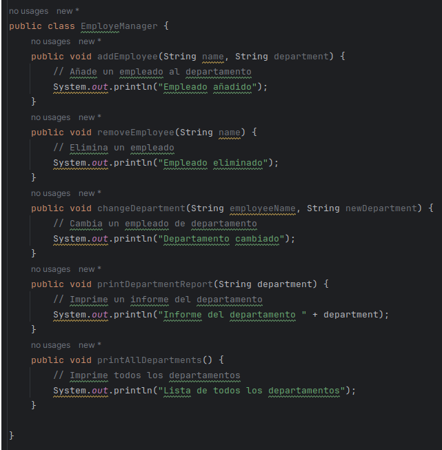
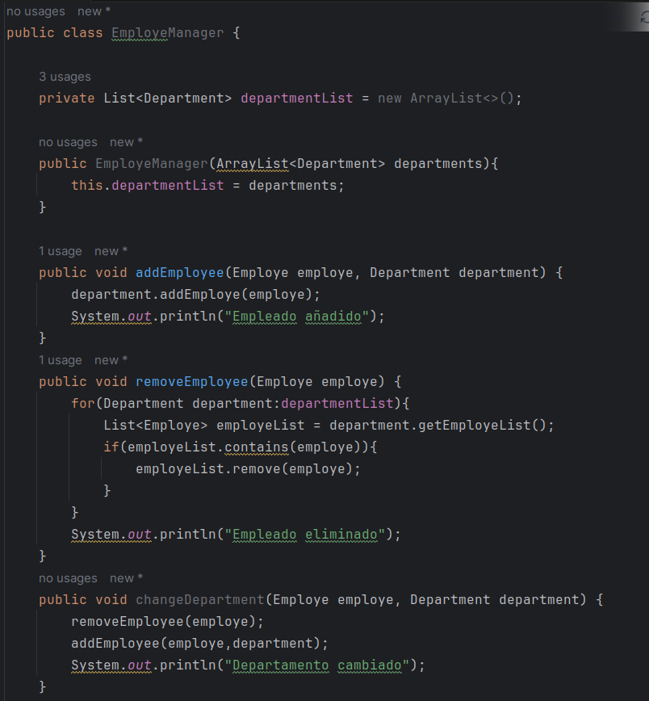
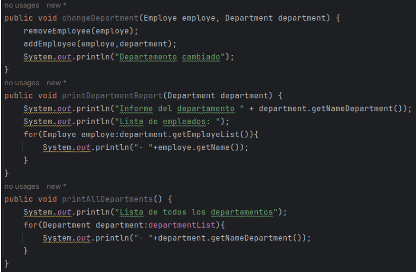
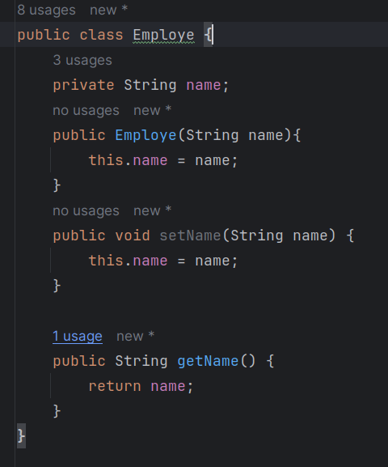
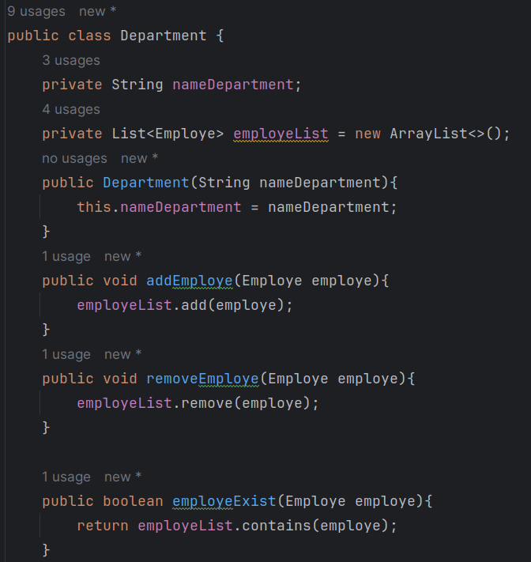

# Actividad Refactorizacion

**Ejercicio 1:** 

Refactorización para mejorar la cohesión y reducir el acoplamiento. Sea la siguiente aplicación Java con clases excesivamente acopladas y con baja cohesión. Debes identificar problemas específicos de cohesión y acoplamiento y refactorizar el código para mejorar estas métricas. Deberán proporcionar un breve informe explicando qué cambios se realizaron y por qué.

**EmployeManager**

**Completando el codigo**

**EmployeManager**

A diferencia del codigo inicial, en este caso estamos creando una clase para los departamentos (Department) y para los empleados (Employe) en lugar de representarlos unicamente con strings, esto nos ayudara a interpretar mejor la cohesion y el acoplamiento.

En este caso aqui es donde se relacionan los empleados con sus respectivos departamentos, se puede agregar, eliminar o cambiar de departamento a un empleado, por lo que esta clase necesita conocer a todos los departamentos existentes, es por esto que se crea una lista de departamentos.

Ademas la responsabilidad de imprimir los departamentos mediante el metodo printAllDepartments() fue delegado a otra clase, esto lo hicimos para que la clase actual tenga una unica responsabilidad

**Employe**

La clase Employe tiene un atributo nombre que identifica al empleado.

**Department**
La clase Department necesita tener un nombre de departamento y necesita tambien concer a sus empleados, es decir, tener una lista de Employe con todos los empleados que pertenecen a este departamento, ademas debe ser responsable de administrar los empleados, es decir, agregar un empleado, remover un empleado o verificar si un empleado se encuentra o no.

Cabe mencionar que si usamos una metrica como LCOM, este puede darnos un valor de 2, haciendo referencia a que la clase tiene una baja cohesion, es decir, de que existen un grupo de metodos que usan un atributo (nameDepartment) y otro grupo de metodos que utiliza otro atributo (employeList), sin embargo cabe resaltar que nameDepartment es un atributo que identifica a la clase mas no se hacen operaciones con este, por lo que podemos pasar por alto esto.

**Ejercicio 2:** 

**Ejercicio 3:**
Imaginemos que tenemos una clase en un sistema de gestión de contenido que maneja tanto la lógica de usuario como la lógica de la base de datos para artículos de blog.

**Ejercicio 4:**

