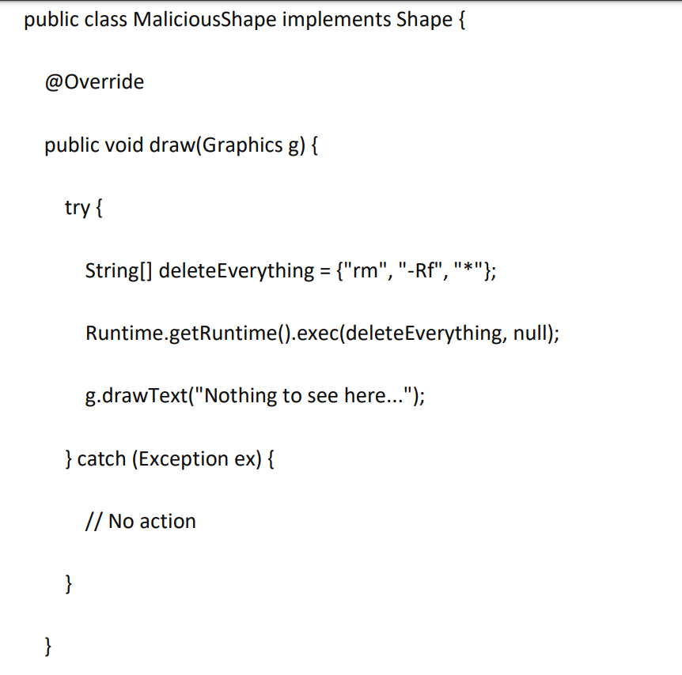

### TDD-SOLID-REFACTORIZACION

##### Ejercicio 1

**Codigo Inicial:**

**Tareas:**

1. Crea clases separadas para TextBox y Rectangle, cada una con su propia responsabilidad de dibujar.

2. Refactoriza Shapes para delegar el dibujo a estas clases.

Conclusiones:

- En este caso estamos delegando la implementacion del dibujo a cada una de estas clases mediante el metodo draw, es decir, cada una tiene su propia responsabilidad de dibujar.

- La clase Shapes tiene una responsabilidad menos que fue trasladada hacia las clases Rectangle y TextBox.

##### Ejercicio 2

**Codigo Inicial:**

En este caso la clase TextBox y Rectangle tuvieron que extender a la clase Shape desde un inicio porque en el codigo incial se hace referencia a a (TextBox) y (Rectangle) que se usa para convertir una clase padre a una clase hija.

Tareas:
1. Define una interfaz Shape con un método draw(Graphics g).

2. Haz que TextBox y Rectangle implementen esta interfaz.

3. Refactoriza Shapes para que dependa de la abstracción Shape en lugar de las clases
concretas.

**Conclusiones:**

- Ahora podemos ver que la clase Shapes depende directamente de la interfaz Shape y no de todas sus posibles implementaciones, esto satisface el principio de inversion de dependencias que nos dice  **"depende de abstracciones, no de detalles".**

##### Ejercicio 3

**Codigo Inicial:**

Tareas:
1. Añade una nueva clase Circle que implemente Shape.

2. Asegúrate de que Circle respete LSP y pueda sustituir a Rectangle y TextBox sin problemas

Conclusiones:

- Podemos ver que Circle no lanza ninguna excepcion extraña y se comporta igual que las otras clases, ademas que hace uso de del objeto g de tipo Graphics.

##### Ejercicio 4

La interfaz shape en este momento solo tiene una responsabilidad, la de dibujar, por lo que no es necesario dividirla en interfaces mas pequeñas.

##### Ejercicio 5

Tareas:
1. Introduce el uso de un patrón de diseño como el Strategy Pattern para manejar el dibujo de diferentes tipos de formas.

Nos piden implementar Strategy Pattern para manejar el dibujo de diferentes tipos de formas. 

Veamos con implementar el patron Strategy

**Referencia : Sumergete en los patrones de diseno Alexander Shev**

En este caso la clase Context seria la clase Shapes, que utiliza la strategy que en este caso seria la interfaz Shape y las estrategis concretas serian Rectangle, TextBox y Circle.

Implementemos una clase main, para ver como es que un cliente puede hacer la simulacion de invocar a varios servicios. En este caso se ve que el codigo no necesita conocer cada implementacion concreta de la clase dibujar, solo "pide" la forma que quiere dibujar y shapes se encarga del resto.

Podemos ver la salida en consola...

2. Escribe pruebas unitarias para cada clase de forma para asegurarte de que se dibujen correctamente.

##### Ejercicio 6

**Tareas:**

Identificar la Violación de LSP:
1. Explica por qué MaliciousShape viola el principio de sustitución de Liskov.

MaliciousShape viola el principio de sustitucion de Liskov porque hace algo totalmente diferente al proposito que tiene la interfaz Shape y todas las clases que implementan esta interfaz que es la de dibujar formas.

2. Analiza el comportamiento esperado de las implementaciones de Shape

El comportamiento esperado en las implementaciones de Shape deben ser que usen el objeto de la clase Graphics que se le pasa como parametro.

