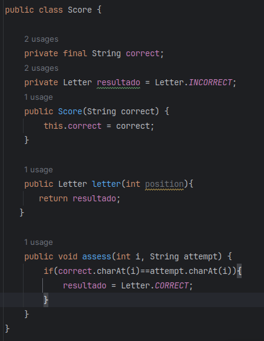
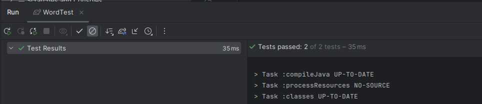
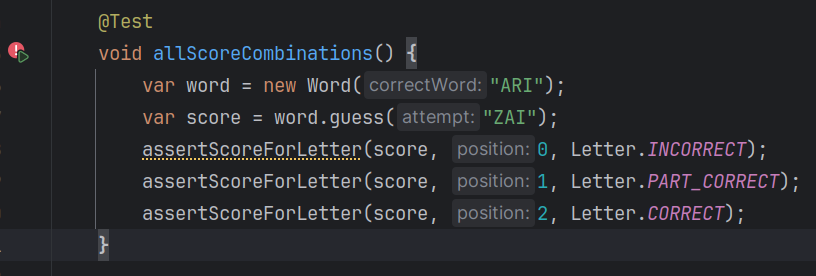

# Ritmo TDD

Podemos verificar que existe una prueba que ya pasa...

Por lo que desde el primer ciclo TDD intentaremos no solo hacer pasar la prueba en la que nos centremos en escribir codigo, sino tambien en hacer que esta prueba mantenga su estado en "verde".

### 1er ciclo TDD

Esta prueba verifica si la letra en la primera posicion (posicion 0) de la  palabra correcta y la palabra intento coinciden.

-------------------------

 1. RED

Veamos que la prueba falle :
Como podemos ver se esperaba CORRECT pero se obtuvo INCORRECT. Esto se debe a que siempre devuelve incorrect (no tiene ninguna logica implementada aun), es por esto que la primera prueba pasa...

 2. GREEN

Ahora escribamos el codigo suficiente para que pase, en este caso estamos creando el metodo asses en Score que verifica si el caracter en la posicion **i** de ambas cadenas es el mismo y en caso asi sea almacena Letter.CORRECT en la variable de instancia resultado.

El metodo guess de Word llama al metodo asses de Score que a su vez devuelve una instancia score que contiene como variable de instancia el resultado de esa comparacion, que luego sera accedida por el metodo letter para hacer la verificacion.

Podemos ver que esta en verde!! Ahora la prueba pasa. y no solo eso, sino que tambien lo hace la anterior quiere decir que no hemos introducido ningun bug en la otra prueba, por lo que vamos por buen camino.

 3. BLUE

 Ahora que ya hemos hecho que pasen estas 2 pruebas, debemos pararnos y pensar en que tan bien estamos escribiendo el codigo. Por lo que ahora trataremos de controlar los code smells...

 Podemos extraer la comparacion isCorrectLetter e implementarla en un metodo de tal forma que todo se mantiene mas claro...

 

 Ademas podemos personalizar nuestra propia assertion de tal forma que el codigo de prueba sea mas legible y entendible...

 

Podemos ver que ahora llamamos directamente a ese assertion personalizado y todo es mas entendible.

 

La siguiente refactorizacion seria convertir position en una variable de instancia, esto puede parecer bastante raro al principio,ya que solo esta evaluando la posicion 0, pero si nos paramos a pensar, solo necesitamos eso por ahora, ya que las pruebas evaluan esa posicion...

Ahora una parte importante en cada paso de refactorizacion anterior es verificar si todo continua en verde despues de realizar cada refactorizacion, si no hemos roto algo a la hora de refactorizar, por lo que corramos de nuevo las pruebas y verifiquemos...

En efecto... podemos ver que siguen en verde!! y ahora tenemos un codigo mas limpio por lo que podemos decir que estamos en azul:) ...

### 2do ciclo TDD

Llegados a este punto, podemos decir que hemos abarcado el codigo para palabras de una sola letra, por lo que ahora introduciremos pruebas para 2 letras...

Para esto esto necesitamos introducir un nuevo concepto : una letra puede estar presente en la palabra, pero no en la posición que adivinamos (PART_CORRECT).

Empecemos escribiendo la prueba...

Esta prueba verifica que la letra de la  posicion 1 de la palabar adivinar "ZA" sea parcialmente correcta (ya que se encuentra en la palabra word pero no en esa posicion)

-------------------------

 1. RED
 
 Podemos ver que la prueba esta en rojo...

 2. GREEN

Ahora toca escribir el codigo suficiente para que esta prueba pase ....

Este codigo toma un contador position, inicializado en 0, y luego va ir aumentando uno en uno, esto devuelve el resultado de la ultima letra, para las pruebas anteriores es suciente, pero... toca preguntarnos si esta prueba es lo suficientemente confiable.

podemos ver que ahora esta en verde...

### 3er ciclo TDD

Hay que reconocer que la prueba anterior no es lo suficientemente buena como para respaldar lo que se quiere probar, es decir, esta prueba puede pasar... pero es porque no estamos evaluando otras posibilidades, hagamos un esfuerzo y escribamos una prueba un poco mas verosimil con el comportamiento que queremos que tenga nuestra clase.

La siguiente prueba verifica en 3 posiciones 3 posibles resultados, por lo que podemos considerar que podemos confiar mas en el codigo que pase esta prueba.

 1. RED

 Podemos ver que la prueba esta en rojo...
 Esto se debe a que siempre se obtiene el resultado de la ultima letra ....

 2. GREEN

 Ahora escribiremos el codigo necesario para que pase ....

En este codigo se hace algo parecido al anterior, solo que se almacena en un arreglo results para cada valor de position, es decir, se almacena un valor resultado para cada una de las letras.

Ahora veamos si este codigo puede pasar nuestra prueba ... 

Podemos ver que ahora si pasa!!

 3. BLUE

Una vez hemos hecho que todas las pruebas pasen, toca refactorizar un poco...

Lo que haremos sera aislar la logica de asignar un resultado a cada una de las letras.

Ahora podemos refactorizar nuestro codigo de prueba para intentar hacer que luzca mejor, para esto solucionaremos los duplicados asserts que se daban para una prueba, para esto extraeremos el metodo assertScoreForGuess(), este metodo 

Al final nuestro codigo de prueba se encuentra asi...

Ahora toca verificar que todo sigue en verde y no hayamos roto nada ...

Sigue en verde!!

