# Actividad6 - RGR+TDD

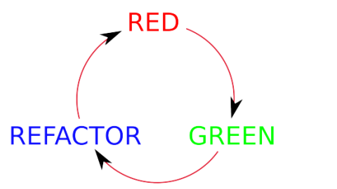

- **Rojo** : Escribir una prueba que falle
- **Verde** : Escribir el codigo suficiente para que pase
- **Azul** : Refactorizar el codigo existente y que la prueba siga en verde

### Los pasos a seguir seran los siguientes

1. Escribir la prueba y ver que falle. (RED)
2. Escribir el codigo suficiente para que la prueba pase (GREEN)
3. Refactorizar el codigo para que no "huela mal". (BLUE) y verificar que la refactorizacion no afecto a las pruebas.

## Empecemos con el codigo ...

### 1. Primer ciclo TDD

- SUT : FootballTeam()
- DOC : getGamesWon()

---------------------------------

    1. La idea es establecer una prueba 
    que verifique la cantidad de juegos
    ganados por un equipo y hacer que falle. 

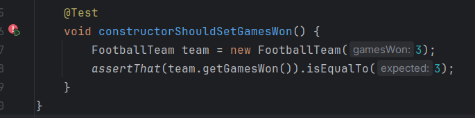
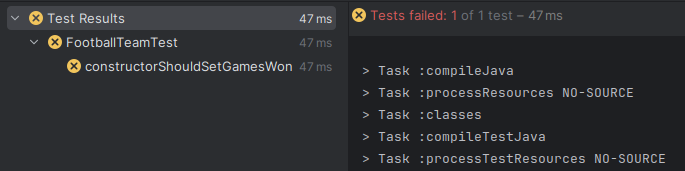

    2. Ahora la idea esta en escribir el codigo 
    suficiente para que la prueba pase, hay que 
    tener cuidado con introducir codigo extra...

    Puede ser que parezca algo absurdo, 
    pero la realidad es que esto nos 
    ayuda a escribir mejores pruebas...

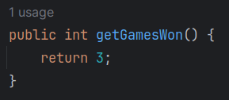

    Ahora veremos que la prueba pasa

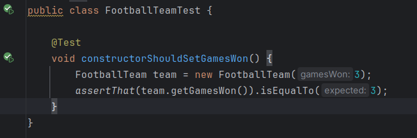

    3. Podemos refactorizar el codigo de 
    test de la siguiente forma..., podemos
    ver que sigue en verde! por lo 
    que la refactorizacion no altero a 
    las pruebas. Ahora esta en Azul!
    

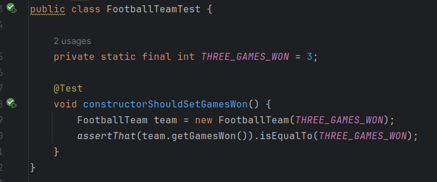

    Nota: Siempre ejecutar las pruebas
    despues de una refactorizacion, por
    mas pequena que parezca la modificacion.

### 2. Segundo ciclo TDD

- SUT : FootballTeam()
- DOC : getGamesWon()

-------------------------
    1. La idea esta en establecer ahora varios 
    parametros para nuestra prueba,
    es decir, vamos a meter mas presion sobre
    esta, para determinar si es buena.

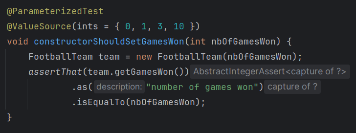

    ahora probemos ... 
    bueno, creo que era bastante evidente lo que
    iba a pasar, considerando que el metodo getter 
    siempre devuelve un valor de 3, todas las 
    que son diferente de 3 fallan.

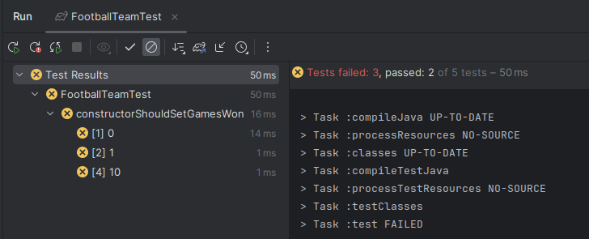

    

    2. ahora toca escribir el codigo suficiente para
    que nuestra querida prueba pase
    y este en verde...

    solucionar esto es tan sencillo como agregar un
    atributo que inicialize la cantidad de juegos 
    ganados en el constructor y que pueda ser 
    accedido por el metodo getter.

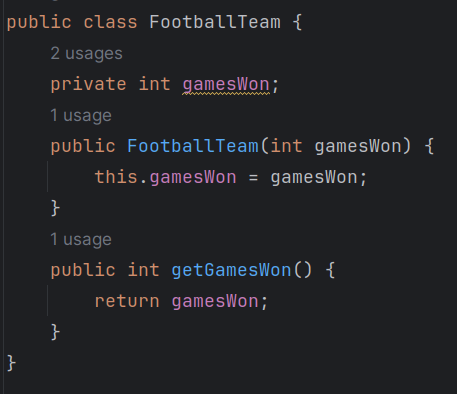

    Ahora, probemos si es que el codigo pasa...

    Esta en verde! es satisfactorio como ver que
    nuestro codigo ahora es valido para distintos
    escenarios, por mas simples que sean.

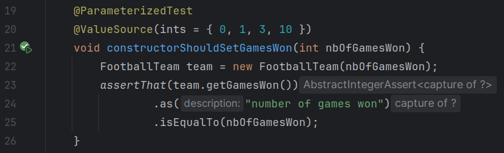
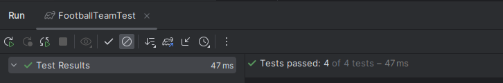

    La refactorizacion en este caso podria ser 
    eliminar el codigo de prueba pasado, que solo 
    verifica para el valor de 3.

### 3. Tercer ciclo TDD

SUT : FootballTeam()
DOC : None

-----------------------

    1. Ahora necesitamos probar los casos en los
    cuales los parametros no son validos, esto es
    importante para que los datos sean coherentes con
    lo que estan representando.
    Para eso escribamos la siguiente prueba que 
    evaluara al constructor para valores negativos.

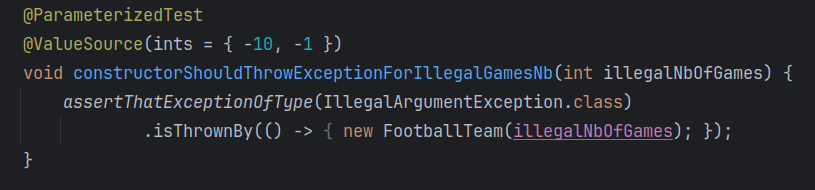

    ahora, pongamos en rojo...

    Podemos ver que falla, esto se debe a que no
    hemos implementado lanzar una excepcion en el 
    constructor en caso reciba valores negativos...

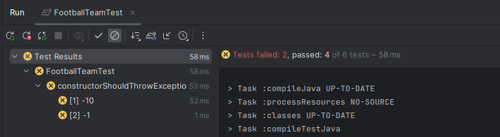

    2. Bueno, ahora tenemos que escribir el codigo
    para que pueda pasar, para esto lanzaremos una 
    excepcion en caso el constructor
    reciba valores negativos, como sigue...

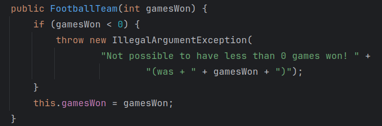

    Ahora probamos la prueba...

    y podemos ver que esta en verde!!

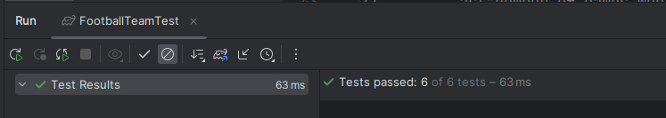

### 4. Cuarto ciclo TDD

- SUT : FootballTeam 
- DOC : None

--------------------------

    1. Todo bien, pero... es comparable?
    implementemoslo!

    Usaremos la interfaz java.lang.Comparable para 
    poder comparar 2 equipos de futbol

    Escribamos la prueba y hagamos que falle

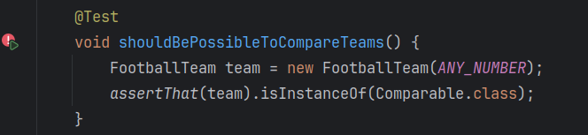
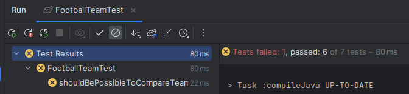

    2. Bueno, ahora tenemos que escribir el codigo
    para que pueda pasar, para esto implementamos 
    la interfaz Comparable y sobreescribimos sus 
    metodos.

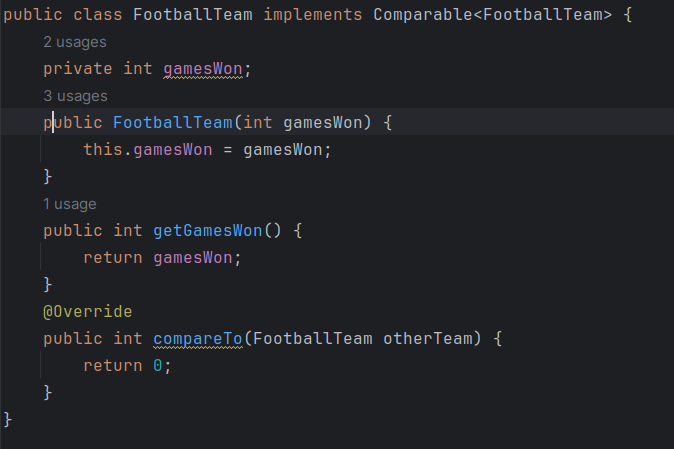

### 5. Quinto ciclo TDD

    1. Dado que ya tenemos una clase comparable, el 
    enfoque esta en, justamente, compararlos ... 

    Por lo que escribimos el siguiente test y 
    hacemos que falle

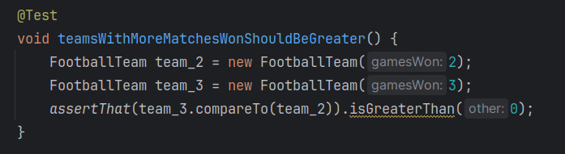
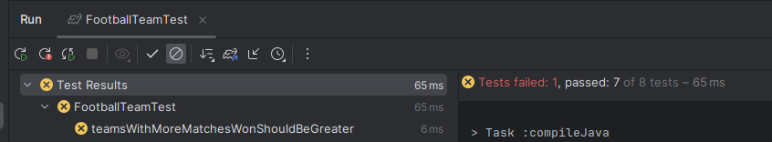

    2. Hagamos un poco mas de esfuerzo que la otra
    vez en la que solo devolviamos 3 y escribamos lo
    siguiente...

    Esto implica si los juegos ganados por el objeto
    que llama al metodo son mayores que los del que
    se pasa como parametro, entonces se devuelve 1 
    sino se devuelve 0.

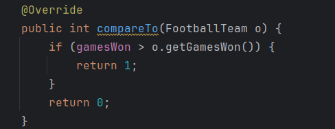

    Ahora si podemos ver que las pruebas pasan!

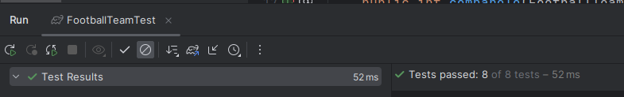

    
### 6. Sexto ciclo TDD

    1. Ahora escribamos la prueba para el caso 
    contrario. Vemos que falla

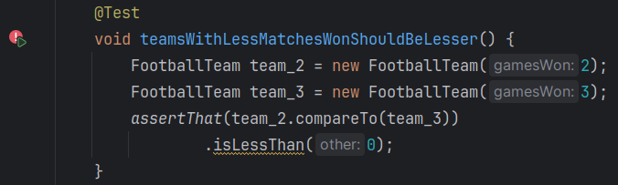

    2. Escribimos codigo suficiente para que la 
    prueba pase...

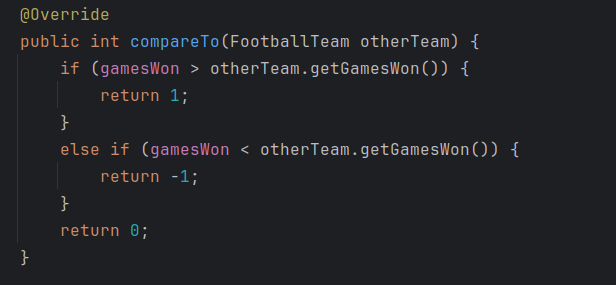 

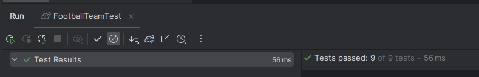

### 7. Septimo ciclo TDD

    1. Ahora para el caso de igualdad.
    Vemos que pasa, pero esto es porque el codigo 
    devuelve 0 en caso de igualdad, pero esto no 
    tiene porque ser asi...

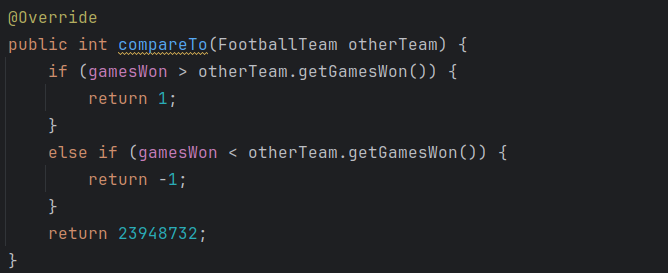

    Ahora si vemos que falla

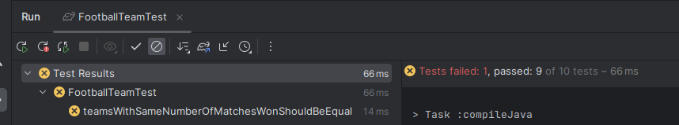

    2. Ahora escribiremos el codigo
    necesario para que pase, devolver 0 ...

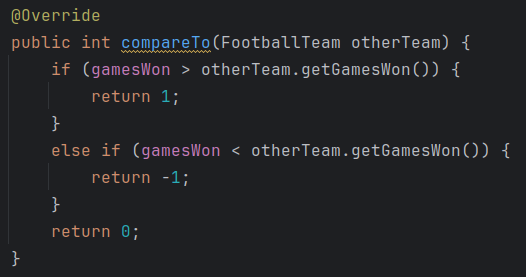

    Vemos que ahora esta en verde!!!

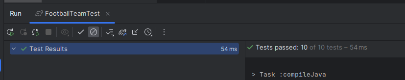

    3. Por ultimo hagamos que este en azul y 
    refactoricemos un poco...

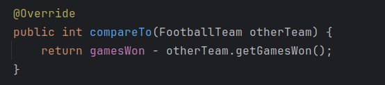

    podemos ver que todavia estan en verde

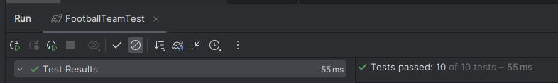

