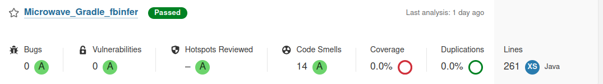
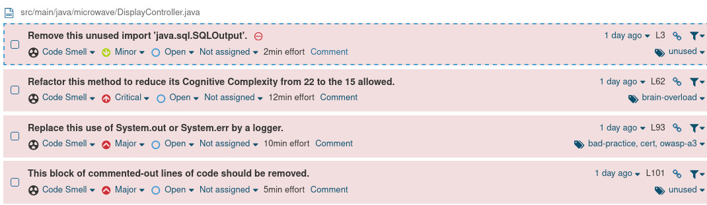
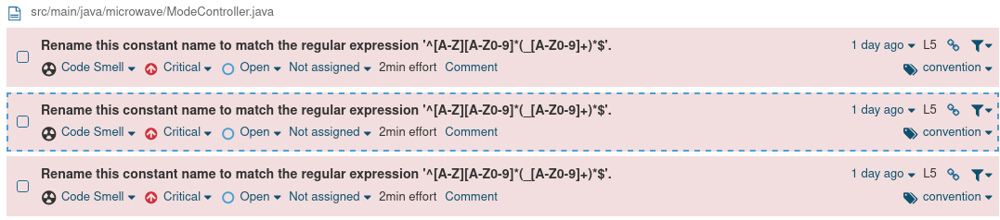
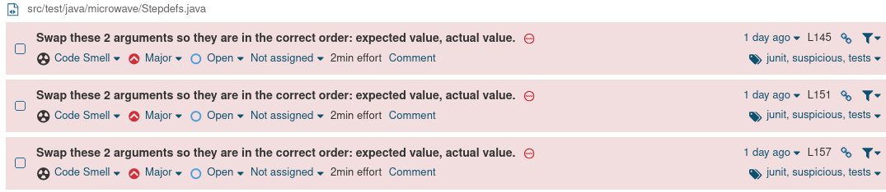
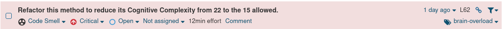
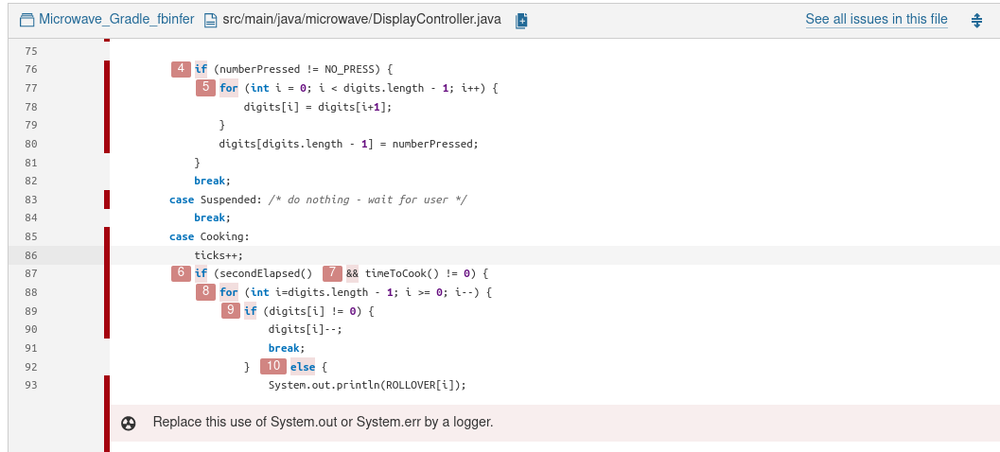
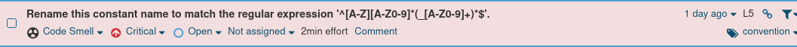
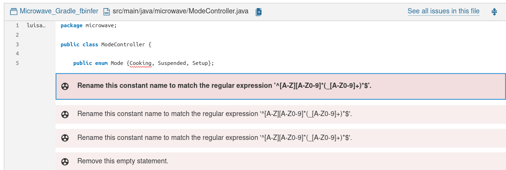
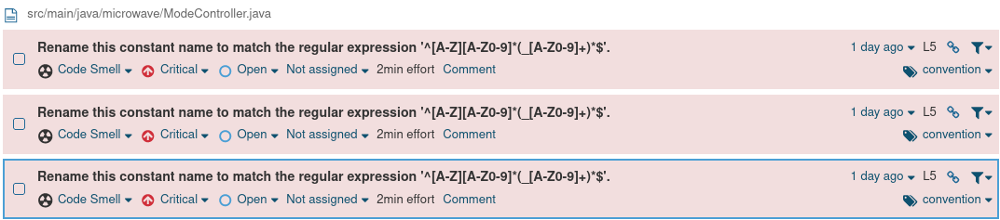

# Actividad 7
En esta actividad veremos le uso de sonarqube para el analisis estatico del codigo.

Para empezar veremos el reporte que tenemos de sonarqube y arreglaremos los que tienen un estado **Critical o Major**.

La idea en general es reducir nuestros **Code Smells**, para tener un codigo mas limpio.

--------------------

### Reporte Sonarqube

---------------------------

#### 1. Primer olor de codigo

#### Segundo olor de codigo

La solucion que nos brinda es la siguiente

Podemos ver que la solucion que nos brinda es eliminar la clase enumerable y cambiar cada uno por una variable, pero podemos considerar que esta clase brindan una mejor forma de referirse a los modos como 

- Mode.Cooking
- Mode.Suspended
- Mode.Setup

Por lo que para este caso considero que podrian ignorarse estos olores de codigo.
    
#### Tercer olor de codigo

