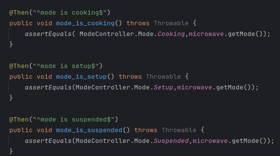

# Actividad 7
En esta actividad veremos le uso de sonarqube para el analisis estatico del codigo.

Para empezar veremos el reporte que tenemos de sonarqube y arreglaremos los que tienen un estado **Critical o Major**.

La idea en general es reducir nuestros **Code Smells**, para tener un codigo mas limpio.

Haremos seguimiento de los code smells que conllevan un cambio en el codigo significativo.

--------------------

### Reporte Sonarqube

---------------------------

#### 1. Primer olor de codigo

una primera refactorizacion podria ser crear un metodo privado en DisplayController que maneje el SetUp y el cooking , para poder hacer el codigo mas entendible, como se muestra:

Ahora veamos si la refactorizacion afecta en algo al comportamiento que se espera de las clases ... podemos ver que siguen pasando las pruebas!!

#### Segundo olor de codigo

Podemos ver que la solucion que nos brinda es eliminar la clase enumerable y cambiar cada valor por una variable final.

Pero podemos considerar que esta clase brindan una forma mas literal y entendible de referirse a los modos como :

- Mode.Cooking
- Mode.Suspended
- Mode.Setup

Por lo que para este caso considero que podrian ignorarse estos olores de codigo.

#### Tercer olor de codigo

Los siguientes olores de codigo hacen referencia a que el primer argumento debe ser el valor esperado y el segundo el valor actual, sinembargo aqui estan en orden distinto, por lo que deben cambiarse...

de manera equivalente podemos ver que las pruebas siguen pasando...

Ahora crearemos un nuevo reporte, para poder determinar cuantos olores de codigo hemos reducido.

Vemos ahora que los olores de codigo se han reducido de 14 a 5, por lo que ahora tenemos un codigo mas limpio, hay que mencionar que 3 de esos 6 decidimos no cambiar, porque consideramos que hacen mas facil la lectura de codigo.

