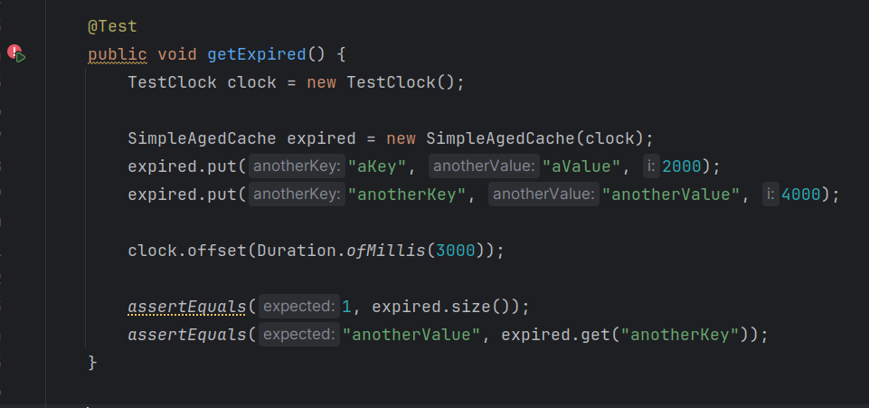

# PC1.1 TDD-RGR

Codigo de pruebas:

Podemos ver que se definen 2 objetos de SimpleAgedCache:

- **empty** : A empty no se le agregara nada (vacio)
- **nonempty** : A nonempty se le agregaran 2 claves con sus respectivos valores (no vacio).

En el metodo before con la notacion **@BeforeEach** (se ejecuta antes de cada prueba), vemos lo que habiamos dicho, se le agrega una 2 keys y un valor respectivo a cada key a nonempty y a empty no se le agrega nada.

Posteriormente tenemos los siguientes metodos de prueba:

1. **isEmpty**: Verifica si cada uno tiene elementos o no.

2. **size** : Verifica el tamanio correcto de cada uno.

3. **get** : El metodo get verifica si un objeto de SimpleAgedCache apartir de las claves puede acceder a sus respectivos valores correctos.

4. **getExpired** : Se verifica si un elemento ha expirado o no, primero agrega un elemento con key="akey" con un tiempo de expiracion de 2000 milisegundos y luego un elemento con key="anotherkey" con un tiempo de expiracion de 4000 milisegundos, luego hace que pasen 3000 milisegundos, lo que implicaria que un elemento de expired (el de key="akey") expire y que sea eliminado del objeto expired por lo que size=1 y luego verificamos si el valor "anotherkey" se encuentra y el valor de su clave es la correcta

Podemos ver ahora que todos los tests fallan.

### 1. Primer ciclo 

En este ciclo TDD tomaremos el test isEmpty, escribiremos el codigo necesario para que pase y por el ultimor refactorizaremos el codigo.

1. Red : Para empezar veamos que falle...

2. Green : Escribamos el codigo necesario para que pase

Inicializamos elementos en 0 y cada vez que se llame a put (agregar elemento) aumentamos el campo elementos, esto puede parecer una implementacion bastante absurda, pero solo nos estamos concentrnado en hacer que esa prueba pase (codigo minimo necesario)...

Veamos que ahora esta en verde!!

y quedan las otras 3 pruebas por pasar...

3. Refactor : Ahora refactorizaremos el codigo ...

Esta refactorizacion reduce la cantidad de lineas de nuestro codigo y lo hace mas entendible

Vemos que aun pasa la prueba!!

### 2. Segundo ciclo 

En este ciclo TDD tomaremos el test size, escribiremos el codigo necesario para que pase y por el ultimor refactorizaremos el codigo.

1. Reed : Para empezar veamos que falle...

2. Green : Escribamos el codigo necesario para que pase

En este caso solo necesitamos devolver el campo contador declarado en el ciclo anterior...

Vemos que ahora la prueba esta en verde!!

y quedan las otras 2 pruebas por pasar...

3. Refactor : Es hora de refactorizar el codigo, podemos darle un nombre mas entendible al campo elementos

elementos -> numeroElementos

y vemos que la prueba sigue pasando...

### 3. Tercer ciclo 

En este ciclo TDD tomaremos el test get y escribiremos el codigo necesario para que pase.

1. Red : Para empezar veamos que falle...

2. Green : Escribamos el codigo necesario para que pase 

Lo que estamos haciendo es declarar 2 arreglos de tipo String para almacenar las keys y los values, en este caso cada key y cada value se relacionan segun el indice del arreglo al que pertenece cada una, es por esto que en el metodo get, retornamos el valor de values[i] en caso se encuentra que akey es igual a keys[i]...

Verificamosque esta en verde!!

y queda 1 ultima prueba por pasar...

### 4. Cuarto ciclo 

En este ciclo TDD tomaremos el test getExpired, escribiremos el codigo necesario para que pase y por el ultimor refactorizaremos el codigo.

1. Red : Para empezar veamos que falle...

2. Green : Escribamos el codigo necesario para que pase

Podemos verificar que hemos agregado un metodo actualizacion, que se implementa en todos los metodos de instancia de esa clase, esto permite tener los datos actualizados en caso el tiempo de uno haya expirado y se llame a un metodo de una instancia de la clase SimpleAgedCache.

 
 Podemos verificar que todos los test pasan(los 4 estan en verde)...

3. Refactor : Ahora toca refactorizar....

Para esto extraeremos 2 metodos del metodo actualizacion que parece ser complicado y dificil de leer, para esto haremos lo siguiente: 

- Extraemos la condicional para verificar si el par key-value expiro o no en el metodo PairExpired

- ademas extraemos el "borrar elemento" (cuando el key-value expiró) en el método dropElement.

Ahora probemos que no hayamos roto nada...

Como podemos ver,sigue en verde!!

