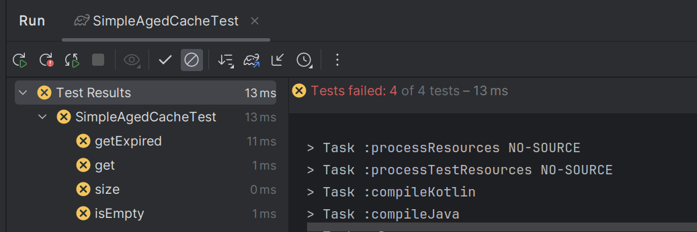
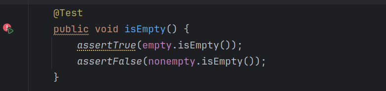
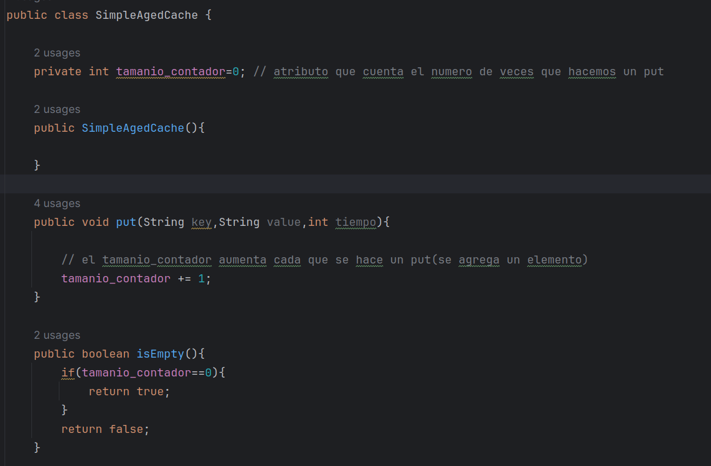
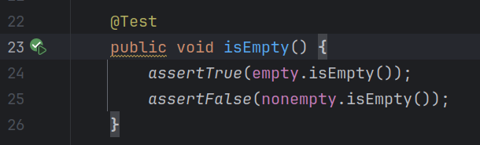
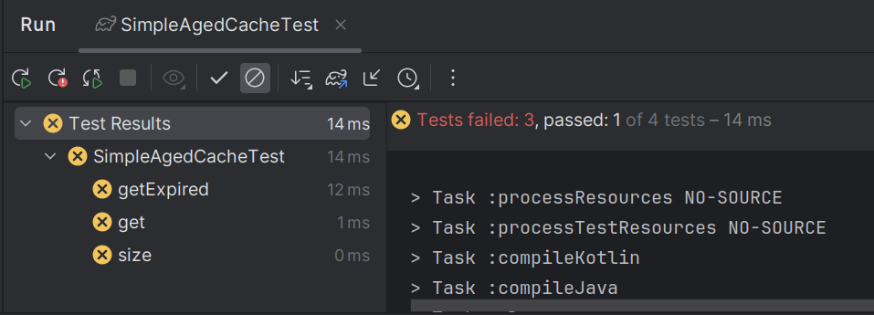
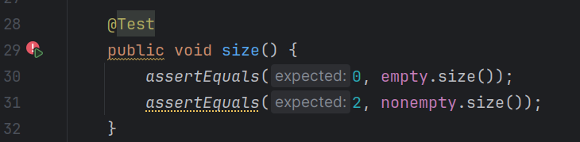
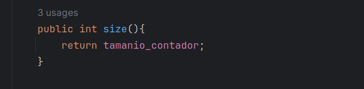
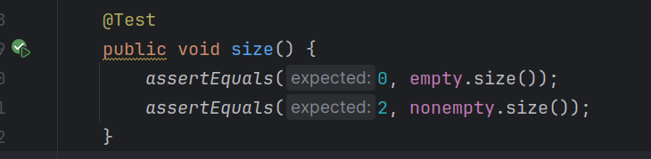
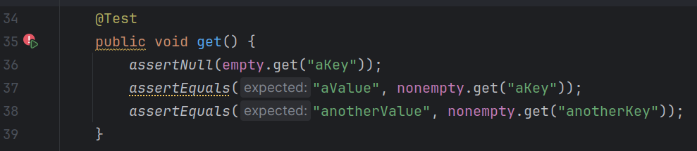

## Informe de simpleAgentCache

Podemos darnos cuenta que al inicio fallan todas las pruebas

Ahora tomaremos el primer test

y escribiremos codigo suficiente para que esa prueba pase.

ahora podemos ver que si pasa!!

ahora tomaremos otro metodo para poder escribir el codigo suficiente para que pase

tomaremos el segundo test

escribimos el codigo suficiente

y podemos ver que el segundo test ahora pasa!!

Ahora tomaremos el tercer test

de la misma manera...

