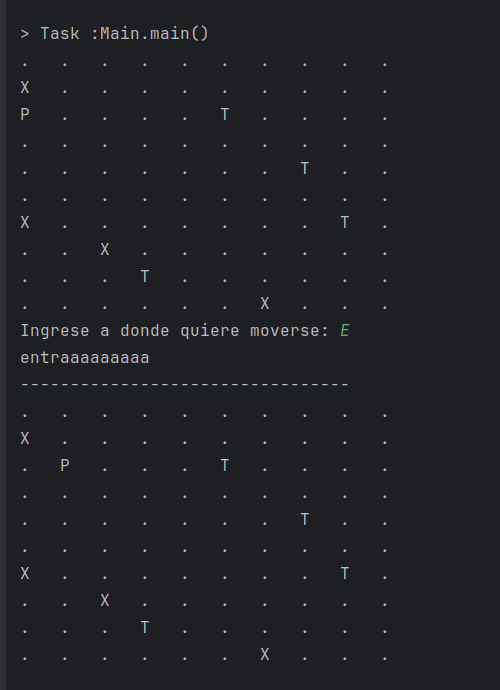

### SPRINT1

Para una entrada **ESTE**

Para otra entrada **SUR**

Como podemos ver en este sprint se ha implementado:
1. Las clases que se indicaron
2. El laberinto inicial con la posicion del jugador, las trampas y recompensas 
3. El movimiento del usuario leido por consola que actualiza el tablero

