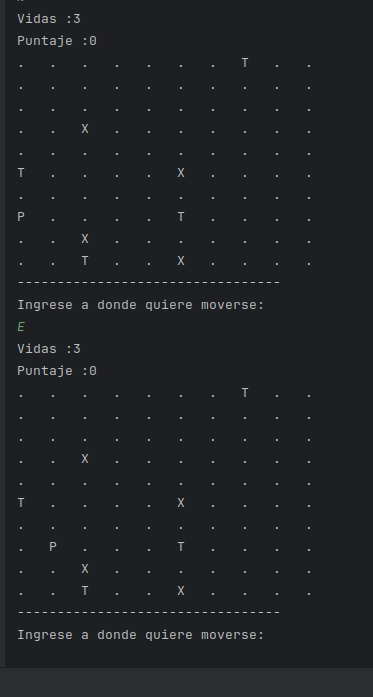

Se implementan muchos cambios del sprint1 al sprint2 , uno de ellos es:

En el sprint1 habiamos creado en el constructor el siguiente codigo.
``` Java
public Laberinto(int size){
    this.size = size;
    matriz = new String[size][size];
    // inicializamos con espacios vacios
    for(int i=0;i<size;i++){
        for(int j=0;j<size;j++){
            matriz[i][j] = ".";
        }
    }

    // Agregamos la posicion del jugador, que es aleatoria
    int[] posicionJugador = posicionAleatoria();
    matriz[posicionJugador[0]][posicionJugador[1]] = "P";

    // Ahora pondremos en el mapa 3 tesoros y 3 trampas de manera aleatoria
    int contador = 0;
    while(contador<4){ // creamos un while para que no se sobreescriban
        int[] posicionTesoros = posicionAleatoria(); // posicion aleatoria para los tesoros
        int[] posicionTrampas = posicionAleatoria(); // posicion aleatoria para las trampas
        if(matriz[posicionTesoros[0]][posicionTesoros[1]].equals(".")
        && matriz[posicionTrampas[0]][posicionTrampas[1]].equals(".")){
            matriz[posicionTesoros[0]][posicionTesoros[1]] = "T";
            matriz[posicionTrampas[0]][posicionTrampas[1]] = "X";
            contador++;
        }
    }
}
```
En el sprint2 nos dicen crear un metodo ColocarTesoros(), entonces extraemos la parte de insertar tesoros y trampas en un metodo aparte, cabe resaltar que esto es una pequeña refactorizacion que hace el codigo mas entendible. 
Cabe descatar ademas que esto se refactorizara mas tarde, ya que un constructor tan largo no
tiene sentido.

```Java

public Laberinto(int size){
    this.size = size;
    matriz = new String[size][size];
    // inicializamos con espacios vacios
    for(int i=0;i<size;i++){
        for(int j=0;j<size;j++){
            matriz[i][j] = ".";
        }
    }
    // Agregamos la posicion del jugador, que es aleatoria
    int[] posicionJugador = posicionAleatoria();
    matriz[posicionJugador[0]][posicionJugador[1]] = "P";

    colcarTesoros();
}

public void colcarTesoros(){
    // Ahora pondremos en el mapa 3 tesoros y 3 trampas de manera aleatoria
    int contador = 0;
    while(contador<4){ // creamos un while para que no se sobreescriban
        int[] posicionTesoros = posicionAleatoria(); // posicion aleatoria para los tesoros
        int[] posicionTrampas = posicionAleatoria(); // posicion aleatoria para las trampas
        if(matriz[posicionTesoros[0]][posicionTesoros[1]].equals(".")
                && matriz[posicionTrampas[0]][posicionTrampas[1]].equals(".")){
            matriz[posicionTesoros[0]][posicionTesoros[1]] = "T";
            matriz[posicionTrampas[0]][posicionTrampas[1]] = "X";
            contador++;
        }
    }
}


```

Ahora podemos ver que hemos implementado las salidas correspondientes:

Imprimimos las vidas y el puntaje que tiene.



