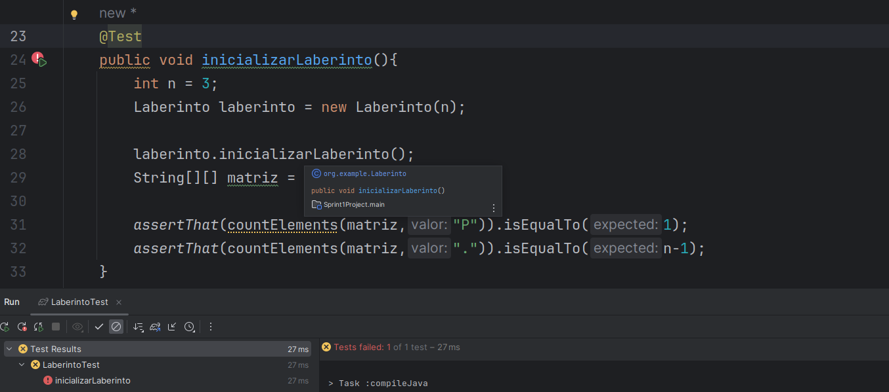
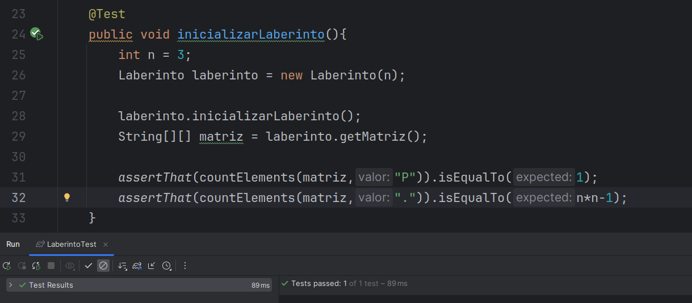
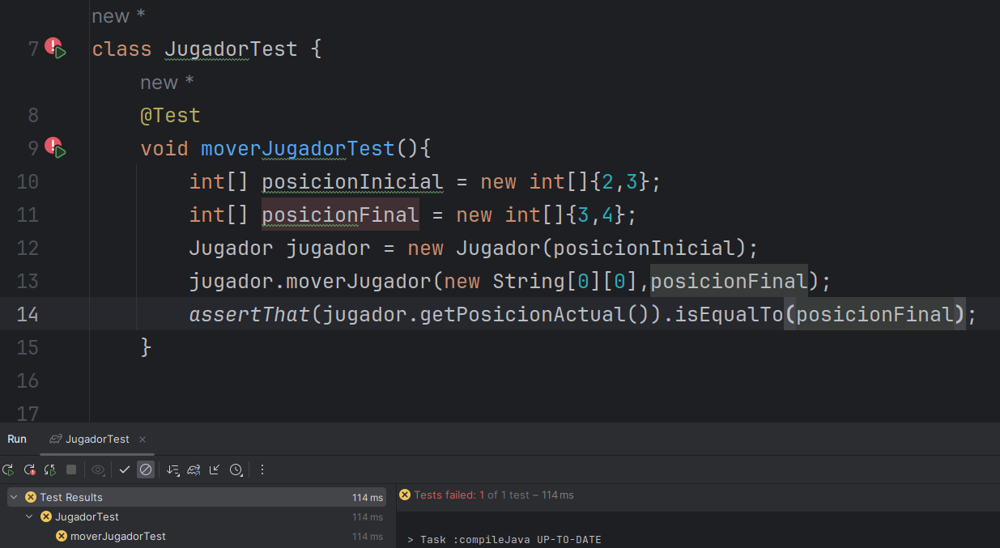
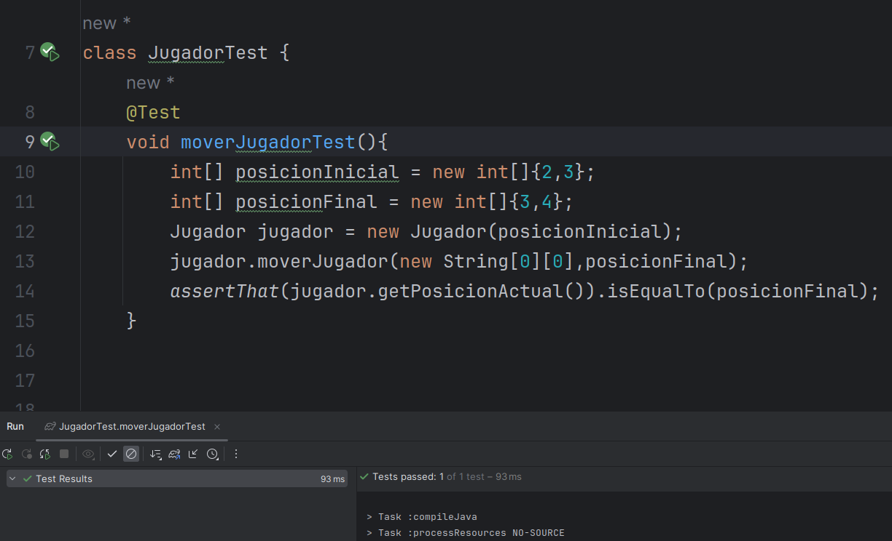
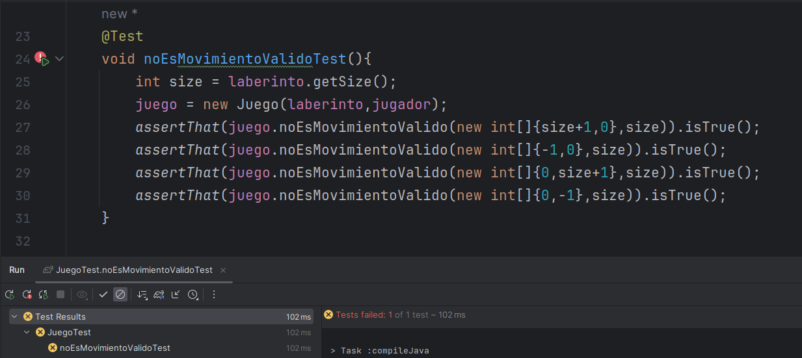
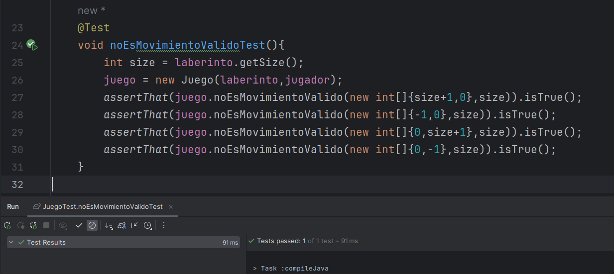
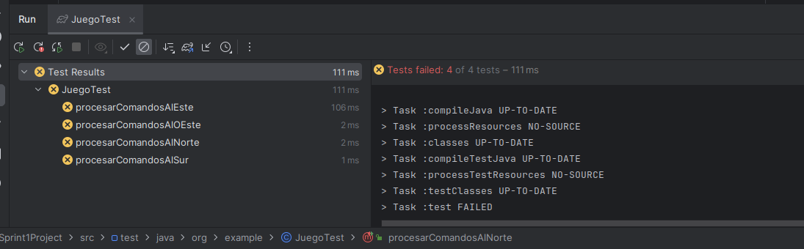
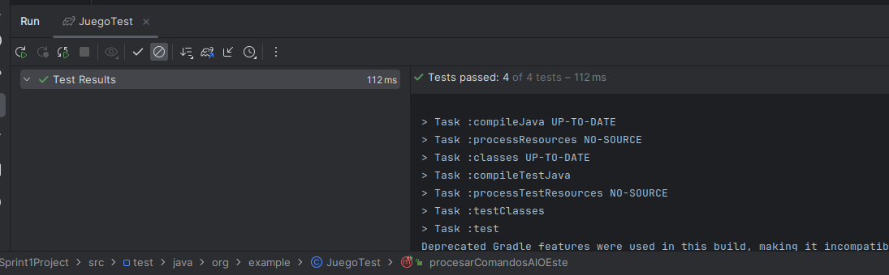
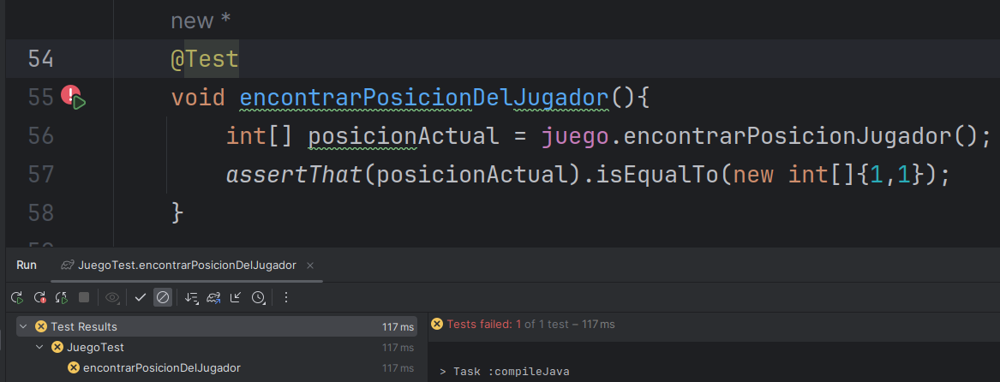
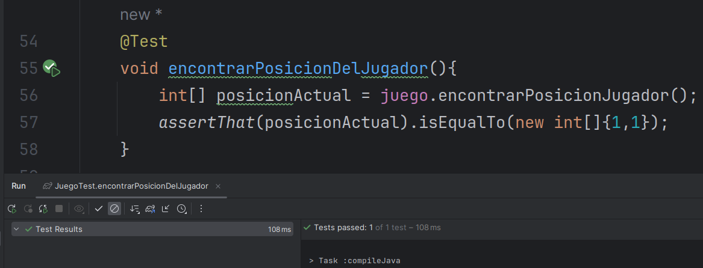

# SPRINT 1

Empecemos con el desarrollo TDD


### LaberintoTest

Como el laberinto se crea de manera aleatoria no podemos saber exactamente
como sera la matriz, pero podemos decir cuantos elementos de cada tipo debe haber
para una matriz de tamaño nxn:
- debe haber 1 jugador -> un valor de "P"
- debe haber n-1 espacios en blanco -> n-1 puntos "."

``` Java
@Test
public void inicializarLaberinto(){
    int n = 3;
    Laberinto laberinto = new Laberinto(n);

    laberinto.inicializarLaberinto();
    String[][] matriz = laberinto.getMatriz();

    assertThat(countElements(matriz,"P")).isEqualTo(1);
    assertThat(countElements(matriz,".")).isEqualTo(n-1);
}
``` 
Veamos que la prueba falle:



Esto es porque no hay ninguna implementacion
Ahora escribimos el codigo suficiente para que pase

``` Java
public void inicializarLaberinto(){

    Random random = new Random();
    int x = random.nextInt(size);
    int y = random.nextInt(size);
    
    for(int i=0;i<size;i++){
        for(int j=0;j<size;j++){
            matriz[i][j] = ".";
        }
    }
    matriz[x][y] = "P";
}

``` 
Podemos ver ahora que esta en verde



### JugadorTest

Ahora testeemos el movimiento del jugador a una nueva casilla.
Esta tiene que actualizar la posicion actual del jugador.

``` Java
@Test
void moverJugadorTest(){
    int[] posicionInicial = new int[]{2,3};
    int[] posicionFinal = new int[]{3,4};
    Jugador jugador = new Jugador(posicionInicial,0,3);
    jugador.moverJugador(new String[0][0],posicionFinal);
    assertThat(jugador.getPosicionActual()).isEqualTo(posicionInicial);
}
``` 
Vemos que la prueba falla porque no hay nada implementado en 
el metodo moverJugador.



Ahora escribiremos el codigo necesario para que pase, cabe
resaltar que aun no estamos agregando las vidas y el puntaje
ya que estos estan asociados con los tesoros y trampas que 
seran añadidos en el sprint2 y cambiara la logica del metodo moverJugador

``` Java
// implica cambiar las vidas, puntaje y posicion del jugador
public void moverJugador(String[][] matriz,int[] posicionFinal){
    actualizarPosicion(posicionFinal);
}

// implica cambiar solo la posicion del jugador
public void actualizarPosicion(int[]posicionFinal){
    setPosicionActual(posicionFinal);
}

```

Ahora veamos que la prueba pasa...




### JuegoTest

En JuegoTest usaremos el constructor con 2 parametros (laberinto y jugador )para poder tener un mayor control de los escenarios
que estaremos probando. Sinembargo en el juego usaremos el contructor de un parametro (tamano del tablero). 

Hemos inicializado con BeforeEach el contexto inicial del juego que consta de:
- El laberinto es de 3x3 
- El jugador se encuentra en la posicion [1,1]

```Java
@BeforeEach
void setUp(){
    String[][] matriz = new String[][]{{".",".","."},
                                        {".","P","."},
                                        {".",".","."}};
    laberinto = new Laberinto(3);
    jugador = new Jugador(new int[]{1,1});
    laberinto.setMatriz(matriz);
    juego = new Juego(laberinto,jugador);
}

```

Ahora escribamos la primera prueba que verifica si el movimiento no es valido
Para eso tomamos los limites tanto superior e inferior de cada eje.

```java
@Test
void noEsMovimientoValidoTest(){
    int size = laberinto.getSize();
    juego = new Juego(laberinto,jugador);
    assertThat(juego.noEsMovimientoValido(new int[]{size+1,0},size)).isTrue();
    assertThat(juego.noEsMovimientoValido(new int[]{-1,0},size)).isTrue();
    assertThat(juego.noEsMovimientoValido(new int[]{0,size+1},size)).isTrue();
    assertThat(juego.noEsMovimientoValido(new int[]{0,-1},size)).isTrue();
}
```

Vemos que la prueba falla porque por defecto el metodo devuelve false.



Ahora implementemos el codigo suficiente para que pase:

``` Java
public boolean noEsMovimientoValido(int posFin[],int size){
    return posFin[0]<0 ||posFin[0]>=size ||
                posFin[1]<0 || posFin[1]>=size;
}

``` 

Podemos ver ahora que esta en verde




Ahora escribamos la segunda prueba que pruebe la funcionalidad de 
procesarComandos, en este caso como el jugador se encuentra en la 
posicion [1,1] y nos movemos en todas las direcciones posibles (Norte, Sur, Este, Oeste).

Hemos creado una prueba para cada una de estas direcciones

```java
@Test
void procesarComandosAlNorte(){
    int[] posicionFinal = juego.procesarComandos("N");
    assertThat(posicionFinal).isEqualTo(new int[]{0,1});
}

@Test
void procesarComandosAlSur(){
    int[] posicionFinal = juego.procesarComandos("S");
    assertThat(posicionFinal).isEqualTo(new int[]{2,1});
}

@Test
void procesarComandosAlEste(){
    int[] posicionFinal = juego.procesarComandos("E");
    assertThat(posicionFinal).isEqualTo(new int[]{1,2});
}

@Test
void procesarComandosAlOEste(){
    int[] posicionFinal = juego.procesarComandos("E");
    assertThat(posicionFinal).isEqualTo(new int[]{1,0});
}
``` 

Ahora veamos que todas estas pruebas fallen:



Ahora escribamos el codigo suficiente para que las prueba pasen:

```java

public int[] procesarComandos(String mov){
    int posicionActual[] = jugador.getPosicionActual();
    int posicionFinal[] = new int[2];
    posicionFinal[0] = posicionActual[0];
    posicionFinal[1] = posicionActual[1];
    // logica de los movimientos
    switch(mov){
        case "N": posicionFinal[0]-=1;break;
        case "S": posicionFinal[0]+=1 ;break;
        case "E":posicionFinal[1]+=1;break;
        case "O":posicionFinal[1]-=1;break;
    }
    if(!noEsMovimientoValido(posicionFinal,laberinto.getSize())){
        return posicionFinal;
    }
    return posicionActual;
}

``` 

Podemos ver ahora que todas las pruebas pasan




Ahora, como la responsabilidad de crear la matriz inicial es de la clase Laberinto y ademas
esta se da de manera totalmente aleatoria entonces la posicion del jugador tambien es 
aleatoria, por lo que la clase Juego (al conocer sobre el Laberinto y el Jugador) sera el
responsable de encontrar la posicion inicial del jugador en el laberinto y hacerselo saber.

Creemos las pruebas para verificar la posicion incial del jugador en el tablero...


```java
@Test
void encontrarPosicionDelJugador(){
    int[] posicionActual = juego.encontrarPosicionJugador();
    assertThat(posicionActual).isEqualTo(new int[]{1,1});
}
```

Hacemos que falle :



Luego esribimos el codigo suficiente para que la prueba pase :

```java

private int[] encontrarPosicionJugador(){
    int[] posicion = new int[2];
    int x = 0,y=0;
    for(int i=0;i<laberinto.getSize();i++){
        for(int j=0;j<laberinto.getSize();j++){
            if(laberinto.getMatriz()[i][j].equals("P")){
                x = i;
                y = j;
                break;
            }
        }
    }
    posicion[0] = x;
    posicion[1] = y;
    return posicion;
}


``` 
Ahora vemos que esta en verde:





**Nota:**
-
    Los metodos que no se implementaron aqui seran implementados
    en el sprint2 ya que en ese sprint introduciremos las recompensas
    y las trampas en el juego junto a sus tests...
