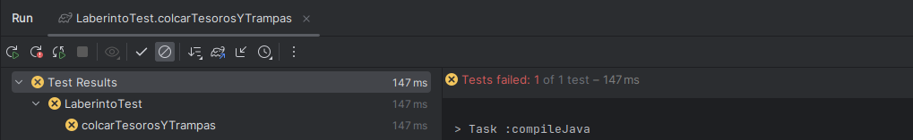
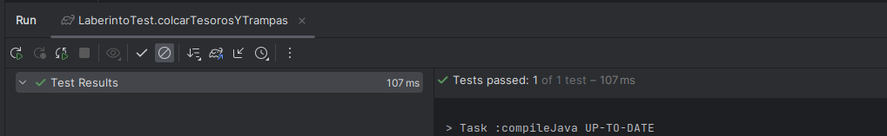

# SPRINT 2

En este sprint introduciremos la logica del juego que implementa las  recompensas y trampas en el laberinto, junto a las vidas
y el puntaje del jugador cuando salta a alguna posicion.

**Empecemos con el desarrollo TDD**

En el sprint anterior nos quedamos con esta prueba, en la que inicializamos un laberinto
vacio con un unico jugador en alguna posicion del tablero.

```java
public class LaberintoTest {
    
    @Test
    public void inicializarLaberinto() {
        int n = 3;
        Laberinto laberinto = new Laberinto(n);

        laberinto.inicializarLaberinto();
        String[][] matriz = laberinto.getMatriz();

        assertThat(countElements(matriz, "P")).isEqualTo(1);
        assertThat(countElements(matriz, ".")).isEqualTo(n * n - 1);
    }

}
```

Ahora tenemos que añadir las trampas y recompensas en el laberinto

Siguiendo TDD creemos primero la prueba ...

1. **ColcarTesorosYTrampas**

En este caso n = 3 indica el tamaño del tablero y tt = 2 indica el numero de
trampas y tesoros en el tablero.

```java
@Test
void colcarTesorosYTrampas(){
    int n = 3,tt = 2;
    Laberinto laberinto = new Laberinto(3);
    
    laberinto.inicializarLaberinto(); // incializamos el laberinto vacio con el jugador "P"
    laberinto.colcarTesorosYTrampas(tt); // ponemos 2 tesoros y 2 trampas
    String[][] matriz = laberinto.getMatriz();
    
    assertThat(countElements(matriz,"P")).isEqualTo(1);
    assertThat(countElements(matriz,"X")).isEqualTo(tt);
    assertThat(countElements(matriz,"T")).isEqualTo(tt);
    assertThat(countElements(matriz,".")).isEqualTo(n*n-1-2*tt);
}
```

Vemos que la prueba falla



Y escribimos el codigo suficiente para que la prueba pase


```java
public void colcarTesorosYTrampas(int n){
    Random random = new Random();
    int contador = 0;
    while(contador<n){ // creamos un while para que no se sobreescriban
        // posicion aleatoria para los tesoros
        int[] posicionTesoros = new int[]{random.nextInt(size),random.nextInt(size)};
        // posicion aleatoria para las trampas
        int[] posicionTrampas = new int[]{random.nextInt(size),random.nextInt(size)};
        
        // Verifica que la posicion de las trampas y los tesoros se coloquen en
        // casillas libres( casillas que no esten ocupadas)
        if(matriz[posicionTesoros[0]][posicionTesoros[1]].equals(".")
                && matriz[posicionTrampas[0]][posicionTrampas[1]].equals(".")){
            matriz[posicionTesoros[0]][posicionTesoros[1]] = "T";
            matriz[posicionTrampas[0]][posicionTrampas[1]] = "X";
            contador++;
        }
        
    }
}

```
Podemos ver que ahora si esta en verde:



2. **ActualizarCelda**

```java
@Test
void actualizarCelda(){
    Laberinto laberinto = new Laberinto(3);
    String matriz[][] = new String[][]{{"P","."},{".","."}};
    laberinto.setMatriz(matriz);
    int[]posicion = new int[]{0,1};
    String tesoro = "T";
    laberinto.actualizarCelda(posicion,tesoro);
    assertThat(laberinto.getMatriz()[posicion[0]][posicion[1]]).isEqualTo(tesoro);
}
```

podemos ver que esta en rojo


Escribimos el codigo suficiente para que pase

```java
public void actualizarCelda(int[]posicion,String celda){
    matriz[posicion[0]][posicion[1]] = celda;
}
```

podemos ver que ahora esta en verde


Ahora veamos que todas las pruebas pasen


### Jugador

En el sprint anterior nos quedamos en que al mover el jugador solo se cambiaba la posicion y no se
alteraban las vidas y puntaje del jugador, en este sprint nos encargaremos de implementar las vidas 
y puntaje del jugador en el juego.

```java
class JugadorTest {
    @Test
    void moverJugadorTest(){
        int[] posicionInicial = new int[]{2,3};
        int[] posicionFinal = new int[]{3,4};
        Jugador jugador = new Jugador(posicionInicial);
        jugador.moverJugador(new String[0][0],posicionFinal);
        assertThat(jugador.getPosicionActual()).isEqualTo(posicionFinal);
    }
}
```

Establezcamos un escenario inicial para el jugador...

En este caso estamos considerando:
- El jugador en la posicion [0,0]
- Una trampa en la posicion [0,1]
- Un tesoro en la posicion [1,0]
- Un espacio vacio en la posicion [1,1]

    [[ "P" , "X" ]
    
    [  "T" , " . " ]]

```java

class JugadorTest {

    private Jugador jugador;
    private String mapa[][];

    // contexto inicial 
    @BeforeEach
    void setUp() {
        int posicionInicial[] = new int[]{0, 1};
        jugador = new Jugador(posicionInicial);
        mapa = new String[][]{{"P", "X"}, {"T", "."}};
    }

    @Test
    void moverJugadorTest() {
        int[] posicionFinal = new int[]{1, 0};
        jugador.moverJugador(mapa, posicionFinal);
        assertThat(jugador.getPosicionActual()).isEqualTo(posicionFinal);
    }
}
```
1. **moverJugadorHaciaUnaTrampa**

Ahora implementemos un test que verifica el cambio de las vidas del jugador al moverse hacia una trampa

```java
@Test
void moverJugadorHaciaUnaTrampa(){
  int[] posicionFinal = new int[]{0,1};
  jugador.moverJugador(mapa,posicionFinal);
  assertThat(jugador.getPosicionActual()).isEqualTo(posicionFinal);
  assertThat(jugador.getVida()).isEqualTo(2);
}
```

Vemos que la prueba falla


Ahora escribamos el codigo necesario para que la prueba pase

```java

public void moverJugador(String[][] matriz,int[] posicionFinal){
  String casillaFin = matriz[posicionFinal[0]][posicionFinal[1]];
  caerEnTrampa(casillaFin);
  actualizarPosicion(posicionFinal);
}

public void caerEnTrampa(String casillaFinal){
    if(casillaFinal.equals("X")){
        vida--;
    }
}

```

Podemos ver que ahora la prueba pasa:


2. **moverJugadorHaciaUnTesoro**

Ahora implementamos un test que verifica el cambio del puntaje del jugador
al moverse hacia un tesoro, este puntaje debe aumentar en 1.

```java
@Test
void moverJugadorHaciaUnTesoro(){
    int[] posicionFinal = new int[]{1,0};
    jugador.moverJugador(mapa,posicionFinal);
    assertThat(jugador.getPosicionActual()).isEqualTo(posicionFinal);
    assertThat(jugador.getPuntaje()).isEqualTo(1);
}
```

Veamos que la prueba falla


Ahora escribamos el codigo necesario para que la prueba pase


```java
public void moverJugador(String[][] matriz,int[] posicionFinal){
    String casillaFin = matriz[posicionFinal[0]][posicionFinal[1]];
    caerEnTrampa(casillaFin);
    recogerTesoro(casillaFin);
    actualizarPosicion(posicionFinal);
}

public void recogerTesoro(String casillaFinal){
    if(casillaFinal.equals("T")){
        puntaje++;
    }
}
```

Podemos ver que ahora la prueba pasa


Ahora veamos que todas las pruebas pasen


### Juego

Ahora tenemos que implementar la logica que conecta al jugador y al laberinto en la clase Juego.
Para empezar cambiemos el escenario del juego, ya que en el anterior sprint no implementamos
los tesoros y las trampas.

Cabe resaltar que esto no afecta a las pruebas anteriores de JuegoTest porque estas pruebas no 
probaban la funcionalidad de trampas y recompensas.


```java
@BeforeEach
void setUp(){
    String[][] matriz = new String[][]{{".","X","."}, //agregamos trampas y tesoros
                                        {"X","P","."},
                                        {".","T","T"}};
    laberinto = new Laberinto(3);
    jugador = new Jugador(new int[]{1,1}); 
    jugador.setVida(1); // seteamos en una vida al jugador
    laberinto.setMatriz(matriz); 
    juego = new Juego(laberinto,jugador);
}
```

Ahora si podemos empezar con las pruebas

1. **actualizarEstadoAlMoverse**

En este caso tenemos 3 posibles escenarios:

- Se mueve a una casilla vacia
- Se mueve a una casilla con una trampa
- Se mueve a una casilla con un tesoro

```java
@Test
void actualizarEstadoAlMoverseAlVacio(){
    int[] posicionActual = juego.encontrarPosicionJugador();
    juego.actualizarEstado("E"); // al ESTE se encuentra un "."
    int vidasIniciales = jugador.getVida();
    int puntajeInicial = jugador.getPuntaje();

    // la posicion inicial queda vacia
    assertThat(laberinto.getMatriz()[posicionActual[0]][posicionActual[1]]).isEqualTo(".");
    // en la posicion final debe encontrarse el jugador
    assertThat(laberinto.getMatriz()[1][2]).isEqualTo("P");
    // El puntaje no cambia
    assertThat(jugador.getVida()).isEqualTo(vidasIniciales);
    // Las vidas siguen siendo las mismas
    assertThat(jugador.getPuntaje()).isEqualTo(puntajeInicial);
}

@Test
void actualizarEstadoAlMoverseAunaTrampa(){
    int[] posicionActual = juego.encontrarPosicionJugador();
    juego.actualizarEstado("N"); // al NORTE se encuentra un "X"
    int vidasIniciales = jugador.getVida();
    int puntajeInicial = jugador.getPuntaje();

    // la posicion inicial queda vacia
    assertThat(laberinto.getMatriz()[posicionActual[0]][posicionActual[1]]).isEqualTo(".");
    // en la posicion final debe encontrarse el jugador
    assertThat(laberinto.getMatriz()[1][2]).isEqualTo("P");
    // El puntaje no cambia
    assertThat(jugador.getVida()).isEqualTo(vidasIniciales);
    // Las vidas disminyen en 1
    assertThat(jugador.getPuntaje()).isEqualTo(puntajeInicial-1);
}

@Test
void actualizarEstadoAlMoverseAunTesoro(){
    int[] posicionActual = juego.encontrarPosicionJugador();
    juego.actualizarEstado("S"); // al SUR se encuentra un "T"
    int vidasIniciales = jugador.getVida();
    int puntajeInicial = jugador.getPuntaje();

    // la posicion inicial queda vacia
    assertThat(laberinto.getMatriz()[posicionActual[0]][posicionActual[1]]).isEqualTo(".");
    // en la posicion final debe encontrarse el jugador
    assertThat(laberinto.getMatriz()[1][2]).isEqualTo("P");
    // El puntaje aumenta en 1
    assertThat(jugador.getVida()).isEqualTo(vidasIniciales+1);
    // Las vidas no cambian
    assertThat(jugador.getPuntaje()).isEqualTo(puntajeInicial);
}
```

Veamos que las pruebas fallen


Escribamos el codigo necesario para que las pruebas pasen

```java
public void actualizarEstado(String mov){
  // Tomamos la posicion inicial y final
  int[] posicionActual = jugador.getPosicionActual();
  int[] posicionFinal = procesarComandos(mov);
  
  // actualizamos las vidas, puntaje y posicion del jugador (actualizacion del jugador)
  jugador.moverJugador(laberinto.getMatriz(), posicionFinal);
  
  // actualizamos la celda inicial y final (actualizacion de laberinto)
  laberinto.actualizarCelda(posicionActual,".");
  laberinto.actualizarCelda(posicionFinal,"P");
}
```

Podemos ver que ahor las pruebas pasan


2. **verificarEstado**

En este caso tenemos 3 posibles escenarios:

- verificar estado en curso del juego
- verificar estado terminado cuando el jugador pierde
- verificar estado terminado cuando el jugador gana

```java
// verifica que el juego siga en curso
@Test
void verificarEstadoEnCursoDelJuego(){
    int estado = juego.verificarEstado();
    assertThat(estado).isEqualTo(0);
}

// Verifica si el jugador perdio la partida
@Test
void verificarEstadoTerminadoDelJuego_Pierde(){

    // Nos movemos a las direcciones de las trampas para perder todas las vidas
    juego.actualizarEstado("N");
    juego.actualizarEstado("E");
    juego.actualizarEstado("S");

    int estado = juego.verificarEstado();

    assertThat(estado).isEqualTo(-1);
}

// Verifica si el jugador gano la partida
@Test
void verificarEstadoTerminadoDelJuego_Gana(){
    // Nos movemos a las direcciones de todos los tesoros para ganar la partida
    juego.actualizarEstado("S");
    juego.actualizarEstado("E");

    int estado = juego.verificarEstado();

    assertThat(estado).isEqualTo(1);
}
```
Escribimos el codigo suficiente para que pase

```java
public int verificarEstado(){
    if(jugador.getVida()==0){
        return -1; // indica que el jugador perdio la partida
    }
    else if(!existenTesoros()){
        return 1; // indica que el jugador gano la partida
    }
    else{
        return 0; // indica que el juego esta en curso
    }
}

private boolean existenTesoros(){
  for(int i=0;i<laberinto.getSize();i++){
    for(int j=0;j<laberinto.getSize();j++){
      if(laberinto.getMatriz()[i][j].equals("T")){
        return true;
      }
    }
  }
  return false;
}
```
Podemos ver que ahora todas las pruebas de JuegoTest pasan


### Salidas

Ademas implementamos la clase Salidas que se encarga de imprimir en consola 
la matriz del laberinto

```java
public class Salidas {

  private Juego juego;

  public Salidas(Juego juego){
    this.juego = juego;
  }


  // se encarga de imprimir el laberinto
  public String[][] mostrarLaberinto(){
    String[][] matriz = juego.getLaberinto().getMatriz();
    Jugador jugador = juego.getJugador();
    System.out.println("Vidas del jugador: "+jugador.getVida());
    System.out.println("Puntaje del jugador: "+jugador.getPuntaje());
    for(int i=0;i<matriz.length;i++){
      for(int j=0;j<matriz.length;j++){
        System.out.print(matriz[i][j]+"\t");
      }
      System.out.println();
    }
    return matriz;
  }

  // se encarga de mostrar el fin del juego
  public void mostrarFinDelJuego(){
    System.out.println("===============================");
    int estado = juego.verificarEstado();
    Jugador jugador = juego.getJugador();
    if(estado==1){ // si el estado = 1 -> el jugador gano
      System.out.println("Ganaste!!! :)");
    }
    else if(estado==-1){ // si el estado = -1 -> el jugador perdio la partida
      System.out.println("Perdiste :( , suerte a la proxima ... ");
    }
    System.out.println("Puntaje: "+jugador.getPuntaje());
    System.out.println("Numero de vidas: "+jugador.getVida());
    System.out.println("===============================");
  }

}
```

Desde la clase Main iniciamos nuestro juego:

```java
public class Main {
  public static void main(String[] args) {
      int estado = 0;
      Juego juego = new Juego(10);
      Salidas salidas = new Salidas(juego);
      Scanner scanner = new Scanner(System.in);
      while(estado==0) {
          estado = juego.verificarEstado();
          salidas.mostrarLaberinto();
          System.out.println("DIRECCION : ");
          String movimiento = scanner.nextLine();
          juego.actualizarEstado(movimiento);
      }
  
      salidas.mostrarFinDelJuego();
  
  }
}
```

Y esta es la salida en consola ...

