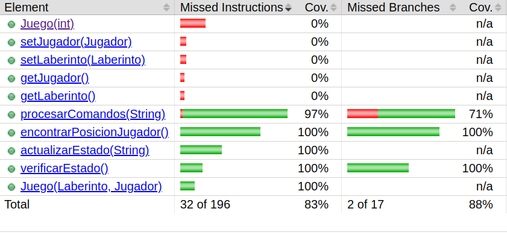
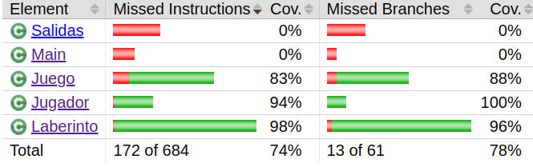

# SPRINT 3

### 1. Aplicar TDD para desarrollar una funcionalidad especifica en el juego.

Descripcion : Implementa una funcionalidad para que el jugador pueda ver cuantos tesoros le faltan para
recolectar.

Creamos el Test que verifique que el numero de tesoros sea el correcto tomando como referencia
el SetUp (el contexto).

```java
@BeforeEach
void setUp(){
    String[][] matriz = new String[][]{{".","X","."}, //agregamos trampas y tesoros
            {"X","P","."},
            {".","T","T"}};
    laberinto = new Laberinto(3);
    jugador = new Jugador(new int[]{1,1});
    jugador.setVida(1); // seteamos en una vida al jugador
    laberinto.setMatriz(matriz);
    juego = new Juego(laberinto,jugador);
}

@Test
void numeroDeTesorosRestantes(){
    
    int nt1 = juego.numeroDeTesorosRestantes(); // deben haber 2 tesoros, segun el setUp establecido
    juego.actualizarEstado("S"); // nos movemos hacia el sur (donde hay un tesoro)
    int nt2 = juego.numeroDeTesorosRestantes(); // habra 1 tesoro menos
    
    // realizamos las aserciones correspondientes
    assertThat(nt1).isEqualTo(2); 
    assertThat(nt2).isEqualTo(1);
}

``` 

Ahora veamos que la prueba falla...


Ahora escribamos el codigo necesario para que la prueba pase ...

```java
public int numeroDeTesorosRestantes() {
    int contador = 0;
    for(int i=0;i<laberinto.getSize();i++){
        for(int j=0;j<laberinto.getSize();j++){
            if(laberinto.getMatriz()[i][j].equals("T")){
                contador++;
            }
        }
    }
    return contador;
}
``` 

Ahora podemos ver que la prueba esta en verde


Podemos refactorizar un poco poniendo el condicional en metodo aparte


```java
public int numeroDeTesorosRestantes() {
    int contador = 0;
    for(int i=0;i<laberinto.getSize();i++){
        for(int j=0;j<laberinto.getSize();j++){
            if(esUnTesoro(i,j)){
                contador++;
            }
        }
    }
    return contador;
}

private boolean esUnTesoro(int i,int j){
    return laberinto.getMatriz()[i][j].equals("T");
}

``` 

Vemos que la prueba sigue en verde ...


Ahora corramos todo nuevamente para ver que no hayamos roto nada ...

Vemos que los 13 Tests (contando a los que implementados en los primeros 2 Sprints) estan en verde


### 2. Mide y mejora las metricas de cohesion y acoplamiento del codigo

Para este ejercico usaremos 3 formas de hallar metricas.

1. Implementando el codigo realizado en la actividad Metricas de calidad (LCOM y LCOM4)
2. Con la formula, es decir, de manera manual (Inestabilidad)
3. Con SonarQube (Complejidad ciclomatica)

#### 2.1 Metricas de cohesion

Usaremos el codigo dado en la actividad de Metricas de calidad para el calculo de LCOM y LCOM4.

Aparte del codigo asociado a LCOM y LCOM4 se desarrollaron 2 clases que facilitan el uso:

1. **MethodAttributesExtractor:**
Nos ayuda a extraer los metodos, atributos y los atributos de instancia asociados
a cada metodo que se quiere analizar.
Se tomo como referencia la plantilla que se dio en la actividad de Metricas de calidad.

```java
public class MethodAttributesExtractor {

    private final ClassOrInterfaceDeclaration classDeclaration;

    public MethodAttributesExtractor(CompilationUnit cu, String className){
        this.classDeclaration = cu.getClassByName(className)
                .orElseThrow(() -> new RuntimeException("Class not found"));
    }

    /*
        Se extraen los atributos de instancia de una clase usados por el metodo con nombre method
        Devuelve un set con todos los atributos de instancia usados por ese metodo.
     */
    public Set<String> extractAttributesOfMethod(String method){

        // extraeremos el metodo de la clase actual
        MethodDeclaration methodDeclaration = classDeclaration.getMethods().stream()
                                                    .filter(m->m.getNameAsString().equals(method))
                                                    .findFirst()
                                                    .orElseThrow(()->new RuntimeException("Method not found"));
        // tomamos el cuerpo de este metodo
        String body = methodDeclaration.getBody().toString();

        // Inicializamos los atributos de esa clase
        Set<String> classAttributes = extractAllAtributes();
        // Inicializamos los atributos del metodo de interes de esa clase
        Set<String> attributesOfMethod = new HashSet<>();

        // Para cada atributo de la clase que este contenido en el cuerpo del metodo lo agreagamos a attributesOfMethod
        for(String attr:classAttributes){
            if(body.contains(attr)){
                attributesOfMethod.add(attr);
            }
        }
        return attributesOfMethod;
    }

    /*
        Devuelve un hash clave-valor donde las clave vendrian a ser el nombre de un metodo
        de instancia y el valores seria un conjunto con los atributos de instancia de esa clase
        son usados por el metodo.
     */
    public Map<String,Set<String>> extractAllAtributesOfEachMethod(){
        Map<String,Set<String>> attrsOfMethods = new HashMap<>();
        Set<String> nameOfMethods = extractAllMethods();
        for(String name:nameOfMethods){
            attrsOfMethods.put(name,extractAttributesOfMethod(name));
        }
        return attrsOfMethods;
    }

    /*
        Se extraen todos los nombres de atributos de una clase en particular
     */
    public Set<String> extractAllAtributes(){
        Set<String> classAttributes = new HashSet<>();
        for(FieldDeclaration fd:classDeclaration.getFields()){
            fd.getVariables().forEach(variable->{classAttributes.add(variable.getNameAsString());});
        }
        return classAttributes;
    }

    /*
        Se extraen todos los nombres de los metodos d euna clase en particular.
     */
    public Set<String> extractAllMethods(){
        Set<String> classMethods = new HashSet<>();
        for(MethodDeclaration md:classDeclaration.getMethods()){
            classMethods.add(md.getNameAsString());
        }
        return classMethods;
    }
}

```


2. **Report:**
Imprime un reporte con las metricas y los valores asociados a estas.

```java
public class Report {

    // Este atributo se usara para extraer los atributos asociados a cada metodo
    MethodAttributesExtractor mthdAttrExtr;

    // Este atributo se usara para mapear las metricas con sus respectivos valores
    Map<String,Integer> scoreMetrics;

    public Report(String path,String className) throws FileNotFoundException {
        String direccion = path+"/"+className+".java"; // direccion del archivo
        FileInputStream in = new FileInputStream(direccion);
        CompilationUnit cu = StaticJavaParser.parse(in);
        mthdAttrExtr = new MethodAttributesExtractor(cu,className); // inicializamos el extractor
        scoreMetrics = new HashMap<>(); // inicializamos el scoreMetrics
    }


    public void doReport(List<String> methods){
        // Extraemos todos los metodos con los respectivos atributos de los cuales hacen uso
        Map<String, Set<String>> methodAttributes = mthdAttrExtr.extractAllAtributesOfEachMethod();
        // Inicializamos las metricas que queremos
        Map<String,ClassMetric> metrics = new HashMap<>();
        addMetrics(metrics);
        // para cada una de las metricas
        for(String metric:metrics.keySet()){
            ClassMetric classMetric = metrics.get(metric);
            // aqui se aplica el LCOM y LCOM4 realizados en clase 
            int valor = classMetric.calculateMetric(methods,methodAttributes);
            scoreMetrics.put(metric,valor);
        }
    }

    // Mostramos el scoreMetrics que fue llenado en DoReport
    public void showReport(){
        for(String metric:scoreMetrics.keySet()){
            System.out.println(metric+" = "+scoreMetrics.get(metric));
        }
    }

    // Se inicializa las metricas que deseamos mostrar en nuestro reporte
    public void addMetrics(Map<String,ClassMetric> metrics){
        metrics.put("LCOM",new Lcom());
        metrics.put("LCOM4",new Lcom4());
    }
}

``` 
Apartir de este codigo podemos crear un reporte para las metricas de LCOM y LCOM4

Aun necesitamos seleccionar los metodos que se consideraran en el calculo de la metrica
ya que sino se puede tomar getters y setters o metodos auxiliares, alterando de esta forma
el calculo de la metrica.

El MethodAttributesExtractor se encargara de encontrar los atributos de instancia que seran usados
por cada metodo.


```java
public class Main {
    public static void main(String[] args) throws FileNotFoundException {
    
        String path = "Sprint1Project/src/main/java/org/example/";
        Report report;
        Map<String,List<String>> methodsClass = new HashMap<>();
    
        // agregamos los metodos de Juego que implementan la logica
        List<String> methodsJuego = new ArrayList<>();
        methodsJuego.add("procesarComandos");
        methodsJuego.add("actualizarEstado");
        methodsJuego.add("verificarEstado");
    
        // agregamos los metodos de Jugador que implementan la logica
        List<String> methodsJugador = new ArrayList<>();
        methodsJugador.add("moverJugador");
        methodsJugador.add("caerEnTrampa");
        methodsJugador.add("recogerTesoro");
    
        // agregamos los metodos de Laberinto que implementan la logica
        List<String> methodsLaberinto = new ArrayList<>();
        methodsLaberinto.add("inicializarLaberinto");
        methodsLaberinto.add("colcarTesorosYTrampas");
        methodsLaberinto.add("actualizarCelda");
    
        // agregamos los nombres de las clases con los nombre de sus metodos a considerar 
        methodsClass.put("Juego",methodsJuego);
        methodsClass.put("Jugador",methodsJugador);
        methodsClass.put("Laberinto",methodsLaberinto);
    
        // para cada clase 
        for(String class_:methodsClass.keySet()){
            System.out.println("============ Class "+class_+" ============= ");
            List<String> methods = methodsClass.get(class_);
            // le pasamos como parametro la clase
            report = new Report(path,class_);
            // le pasamos como parametro la lista de metodos a considerar
            report.doReport(methods);
            report.showReport();
            System.out.println("\n");
        }
    
    }
}

``` 

Ahora veamos la saldida


Podemos ver que el problema se da con la clase Jugador, es decir, esta clase tiene una baja cohesion.
Para este valor del LCOM podemos decir que esta clase puede ser divida facilmente en otras 3 clases.

Veamos el codigo:

```java
public class Jugador {
    private int[] posicionActual;
    private int puntaje = 0;
    private int vida = 3;

    public Jugador(int[] posicionActual) {
        this.posicionActual = posicionActual;
    }

    // implica cambiar las vidas, puntaje y posicion del jugador
    public void moverJugador(String[][] matriz, int[] posicionFinal) {
        String casillaFin = matriz[posicionFinal[0]][posicionFinal[1]];
        caerEnTrampa(casillaFin);
        recogerTesoro(casillaFin);
        actualizarPosicion(posicionFinal);
    }

    public void caerEnTrampa(String casillaFinal) {
        if (casillaFinal.equals("X")) {
            vida--;
        }
    }

    public void recogerTesoro(String casillaFinal) {
        if (casillaFinal.equals("T")) {
            puntaje++;
        }
    }
}
``` 

Podemos ver que esto se debe a una pequeña refactorizacion que hicimos anteriormente, es decir,
no se trata de que estos metodos esten haciendo tareas distintas sino que un metodo grande
se ha divido en metodos mas pequeños para que el codigo pueda entenderse mejor.

#### 2.2 Metricas de Acoplamiento

Ahora usaremos la metricas Inestabilidad como metrica de acoplamiento. Esta la calcularemos directamente con la formula

I =  Ce/(Ce+Ca)

- Juego

    **Calculo de Ce:** La clase Juego usa las clase Jugador y Laberinto , entonces Ce = 2.

    **Calculo de Ca:** La clase Juego no es usada por otra clase, entonces Ca = 0.

    **Por lo que I = 2/(2+0) = 1**

    Esto quiere decir que este modulo es propenso a cambios, esto se da porque es la clase central de nuestro programa,
    es decir, controla la logica del juego y se apoya de los otros modulos.


- Jugador

  **Calculo de Ce:** La clase Jugador no hace uso de ninguna otra clase , entonces Ce = 0.

  **Calculo de Ca:** La clase Jugador es usada por la clase Juego, entonces Ca = 1.

  **Por lo que I = 0/(0+1) = 0**

  Esto quiere decir que este modulo es estable y no se vera directamente afectado por cambios en otros modulos.


- Laberinto

    **Calculo de Ce:** La clase Laberinto no usa ninguna otra clase, Ce = 0.

    **Calculo de Ca:** La clase Laberinto es usada por la clase Juego, entonces Ca = 1.
    
    **Por lo que I = 0/(0+1) = 0**
    
    Esto quiere decir que este modulo es totalmente estable y no se vera directamente afectado por cambios en otros modulos.

#### 2.3 Complejidad Ciclomatica

Como mencionamos usaremos SonarQube para el calculo de la complejidad ciclomatica


Nos centraremos en las 3 primeras clases

- Juego , ALTA
- Laberinto , MODERADA
- Jugador , MODERADA

### 3. Aplica lo principios SOLID al diseño del juego

1. Principio de unica responsabilidad (SRP):

**Jugador**

Reponsabilidades :

- Conocer su posicion y cambiarla al realizar un movimiento.
- Conocer sus atributos asociados (vidas y puntajes) y cambiarlos (en caso sea necesario) al realizar un movimiento.
```java

public class Jugador {
    private int[] posicionActual;
    private int puntaje = 0;
    private int vida = 3;

    public Jugador(int[] posicionActual) {
        this.posicionActual = posicionActual;
    }

    // implica cambiar las vidas, puntaje y posicion del jugador
    public void moverJugador(String[][] matriz, int[] posicionFinal) {
        String casillaFin = matriz[posicionFinal[0]][posicionFinal[1]];
        // conocer y cambiar sus atributos asociados al realizar un movimiento
        caerEnTrampa(casillaFin);
        recogerTesoro(casillaFin);
        // conocer y cambiar su posicion al realizar un movimiento
        actualizarPosicion(posicionFinal);
    }

    public void caerEnTrampa(String casillaFinal) {
        if (casillaFinal.equals("X")) {
            vida--;
        }
    }

    public void recogerTesoro(String casillaFinal) {
        if (casillaFinal.equals("T")) {
            puntaje++;
        }
    }
}
```

**Laberinto**

Responsabilidades:
- Realizar cualquier tipo de verificacion o modificacion en la matriz

```java
public class Laberinto {
    private String[][] matriz;
    private int size;

    public Laberinto(int size) {
        this.matriz = new String[size][size];
        this.size = size;
        inicializarLaberinto();
        colcarTesorosYTrampas(size / 2);
    }

    public void inicializarLaberinto() {
        Random random = new Random();
        int x = random.nextInt(size);
        int y = random.nextInt(size);
        for (int i = 0; i < size; i++) {
            for (int j = 0; j < size; j++) {
                matriz[i][j] = ".";
            }
        }
        matriz[x][y] = "P";
    }

    public void colcarTesorosYTrampas(int n) {
        Random random = new Random();
        int contador = 0;
        while (contador < n) { // creamos un while para que no se sobreescriban
            int[] posicionTesoros = new int[]{random.nextInt(size), random.nextInt(size)}; // posicion aleatoria para los tesoros
            int[] posicionTrampas = new int[]{random.nextInt(size), random.nextInt(size)}; // posicion aleatoria para las trampas
            if (matriz[posicionTesoros[0]][posicionTesoros[1]].equals(".")
                    && matriz[posicionTrampas[0]][posicionTrampas[1]].equals(".")) {
                matriz[posicionTesoros[0]][posicionTesoros[1]] = "T";
                matriz[posicionTrampas[0]][posicionTrampas[1]] = "X";
                contador++;
            }
        }
    }

    public void actualizarCelda(int[] posicion, String celda) {
        matriz[posicion[0]][posicion[1]] = celda;
    }
}
```

**Juego**

Responsabilidades:

- Realizar la logica del juego conectando al Jugador y al Laberinto

```java
public class Juego {
    private Laberinto laberinto;
    private Jugador jugador;

    /*
        Constructor para incializar un juego -> genera el laberinto aleatorio
     */
    public Juego(int size){
        this.laberinto = new Laberinto(size);
        this.jugador = new Jugador(encontrarPosicionJugador());
    }

    /*
        Constructor para testear -> inicializa el Laberinto y jugador
     */
    public Juego(Laberinto laberinto,Jugador jugador){
        this.laberinto = laberinto;
        this.jugador = jugador;
    }

    // procesa los comandos, apartir de un movimiento (nos devuelve la posicion final
    // a la que se debe mover el jugar)
    public int[] procesarComandos(String mov){
        int posicionActual[] = jugador.getPosicionActual();
        // copiamos el arreglo inicial en el final
        int posicionFinal[] = new int[2];
        posicionFinal[0] = posicionActual[0];
        posicionFinal[1] = posicionActual[1];
        // logica de los movimientos
        switch(mov){
            case "N": posicionFinal[0]-=1;break;
            case "S": posicionFinal[0]+=1 ;break;
            case "E":posicionFinal[1]+=1;break;
            case "O":posicionFinal[1]-=1;break;
        }
        if(!noEsMovimientoValido(posicionFinal,laberinto.getSize())){
            return posicionFinal; // si el movimiento es valida retornamos el final
        }
        return posicionActual; // si el movimiento no es valido entonces retornamos el inicial
    }

    public void actualizarEstado(String mov){
        // Tomamos la posicion inicial y final
        int[] posicionActual = jugador.getPosicionActual();
        int[] posicionFinal = procesarComandos(mov);

        // actualizamos las vidas, puntaje y posicion del jugador (actualizacion del jugador)
        jugador.moverJugador(laberinto.getMatriz(), posicionFinal);

        // actualizamos la celda inicial y final (actualizacion de laberinto)
        laberinto.actualizarCelda(posicionActual,".");
        laberinto.actualizarCelda(posicionFinal,"P");
    }


    // verifica victoria, derrota o juego en curso
    public int verificarEstado(){
        if(jugador.getVida()==0){
            return -1; // indica que el jugador perdio la partida
        }
        else if(!existenTesoros()){
            return 1; // indica que el jugador gano la partida
        }
        else{
            return 0; // indica que el juego esta en curso
        }
    }

    public boolean noEsMovimientoValido(int posFin[],int size){
        return posFin[0]<0 ||posFin[0]>=size ||
                posFin[1]<0 || posFin[1]>=size;
    }

    // Este metodo se usa para poder determinar la posicion del jugador una vez iniciado el tablero
    public int[] encontrarPosicionJugador(){
        int[] posicion = new int[2];
        int x = 0,y=0;
        for(int i=0;i<laberinto.getSize();i++){
            for(int j=0;j<laberinto.getSize();j++){
                // si el jugador se encuentra en la posicion [i,j] entonces lo guardamos en [x,y]
                if(Objects.equals(laberinto.getMatriz()[i][j], "P")){
                    x = i;
                    y = j;
                    break;
                }
            }
        }
        // devolvemos un arreglo con las posiciones del jugador [x,y]
        posicion[0] = x;
        posicion[1] = y;
        return posicion;
    }

    private boolean existenTesoros(){
        for(int i=0;i<laberinto.getSize();i++){
            for(int j=0;j<laberinto.getSize();j++){
                if(laberinto.getMatriz()[i][j].equals("T")){
                    return true;
                }
            }
        }
        return false;
    }

    public int numeroDeTesorosRestantes() {
        int contador = 0;
        for(int i=0;i<laberinto.getSize();i++){
            for(int j=0;j<laberinto.getSize();j++){
                if(esUnTesoro(i,j)){
                    contador++;
                }
            }
        }
        return contador;
    }

    private boolean esUnTesoro(int i,int j){
        return laberinto.getMatriz()[i][j].equals("T");
    }
    
}
```

De estos metodos consideramos que existen algunos que tienen que ver con verificaciones
en la matriz y que por lo tanto, deben pertenecer a la clase Laberinto y no a la clase Juego.
Por lo que podemos decir que la clase Juego comparte algunas responsabilidades que le pertenecen
a la clase Laberinto al ser esta la que conoce a la matriz.

- numeroDeTesorosRestantes = existenTesoros (verifica en la matriz)
- esUnTesoro (verifica en la matriz)
- encontrarPosicionJugador (busca en la matriz)
- noEsMovimientoValido (verifica los limites de la matriz)


```java
// ANTES
public class Juego{
  // ... otros metodos
  public boolean noEsMovimientoValido(int[]posFin,int size){
    return posFin[0]<0 ||posFin[0]>=size ||
            posFin[1]<0 || posFin[1]>=size;
  }
}

// DESPUES 
public class Laberinto {
  // ... otros metodos
  public boolean noEsCasillaValida(int[] casilla) {
      return casilla[0] < 0 || casilla[0] >= size ||
              casilla[1] < 0 || casilla[1] >= size;
  }
}
```

```java
// ANTES
public class Juego{
  // ... otros metodos
  private boolean existenTesoros(){
    for(int i=0;i<laberinto.getSize();i++){
      for(int j=0;j<laberinto.getSize();j++){
        if(laberinto.getMatriz()[i][j].equals("T")){
          return true;
        }
      }
    }
    return false;
  }

  public int numeroDeTesorosRestantes() {
    int contador = 0;
    for(int i=0;i<laberinto.getSize();i++){
      for(int j=0;j<laberinto.getSize();j++){
        if(esUnTesoro(i,j)){
          contador++;
        }
      }
    }
    return contador;
  }

  private boolean esUnTesoro(int i,int j){
    return laberinto.getMatriz()[i][j].equals("T");
  }
}

// DESPUES 
public class Laberinto {
  // ... otros metodos
  public int numeroDeTesoros(){
    int contador = 0;
    for(int i=0;i<size;i++){
      for(int j=0;j<size;j++){
        if(matriz[i][j].equals("T")){
          contador++;
        }
      }
    }
    return contador;
  }
}
```

```java
// ANTES
public class Juego{
  public int[] encontrarPosicionJugador(){
    // ... otros metodos
    int[] posicion = new int[2];
    int x = 0,y=0;
    for(int i=0;i<laberinto.getSize();i++){
      for(int j=0;j<laberinto.getSize();j++){
        // si el jugador se encuentra en la posicion [i,j] entonces lo guardamos en [x,y]
        if(Objects.equals(laberinto.getMatriz()[i][j], "P")){
          x = i;
          y = j;
          break;
        }
      }
    }
    // devolvemos un arreglo con las posiciones del jugador [x,y]
    posicion[0] = x;
    posicion[1] = y;
    return posicion;
  }
}

// DESPUES 
public class Laberinto {
  // ... otros metodos
  public int[] encontrarPosicionJugador(){
    for(int i=0;i<size;i++){
      for(int j=0;j<size;j++){
        // si el jugador se encuentra en la posicion [i,j] entonces lo guardamos en [x,y]
        if(Objects.equals(matriz[i][j], "P")){
          return new int[]{i,j};
        }
      }
    }
    return new int[0];
  }
}

```
Con este cambio cada clase tiene una unica responsabilidad, satisfaciendo asi el primer principio.

2. DIP

Ahora supongamos que nos cansamos de jugar en consola y ahora queremos implementar interfaces graficas.
Esto seria un problema si el codigo de la aplicacion depende de la clase Salidas y no de una interfaz
que pueda implementarse de diferentes formas.

Para esto podemos usar el principio de inversion de dependencias que nos dicen que dependamos de interfaces y
no de implementaciones...

```java
public interface Graficas {
    public void mostrarLaberinto();
    public void mostrarFinDelJuego();
}
```

```java

public class Salidas implements Graficas{
  private Juego juego;
  public Salidas(Juego juego){
    this.juego = juego;
  }

  // se encarga de imprimir el laberinto
  @Override
  public void mostrarLaberinto(){
    String[][] matriz = juego.getLaberinto().getMatriz();
    Jugador jugador = juego.getJugador();
    System.out.println("Vidas del jugador: "+jugador.getVida());
    System.out.println("Puntaje del jugador: "+jugador.getPuntaje());
    for(int i=0;i<matriz.length;i++){
      for(int j=0;j<matriz.length;j++){
        System.out.print(matriz[i][j]+"\t");
      }
      System.out.println();
    }
  }

  // se encarga de mostrar el fin del juego
  @Override
  public void mostrarFinDelJuego(){
    System.out.println("===============================");
    int estado = juego.verificarEstado();
    Jugador jugador = juego.getJugador();
    if(estado==1){ // si el estado = 1 -> el jugador gano
      System.out.println("Ganaste!!! :)");
    }
    else if(estado==-1){ // si el estado = -1 -> el jugador perdio la partida
      System.out.println("Perdiste :( , suerte a la proxima ... ");
    }
    System.out.println("Puntaje: "+jugador.getPuntaje());
    System.out.println("Numero de vidas: "+jugador.getVida());
    System.out.println("===============================");
  }
}

```
Ahora podemos ver que la clase Main depende de la interfaz Graficas en lugar de una implementacion concreta como Salidas.
Solo basta cambiar la inicializacion **graficas = new NuevaImplementacionGrafica(Juego);**
```java
public class Main {
    private static Juego juego = new Juego(10);
    private static Graficas graficas;

    public static void main(String[] args) throws FileNotFoundException {
        graficas = new Salidas(juego);
        start();
    }
    private static void start(){
        int estado = 0;
        Scanner scanner = new Scanner(System.in);
        while(estado==0) {
            estado = juego.verificarEstado();
            graficas.mostrarLaberinto();
            System.out.println("DIRECCION : ");
            String movimiento = scanner.nextLine();
            juego.actualizarEstado(movimiento);
        }
        graficas.mostrarFinDelJuego();
    }
}
```
Esto tambien cumple el principio SOLID OCP

Ya que la clase esta cerrada para su modificacion pero abierta para su extension, es decir, si se quiere añadir
una nueva forma de interfaz grafica solo se tendra que extender (implementar) la interfaz Graficas en lugar
de modificar un codigo ya existente.

### 4. Mide y mejora la cobertura de codigo usando Jacoco

Veamos el coverage en SonarQube


Veamos ahora el coverage en Jacoco


En lo particular, a mi me gusta usar mas la herramienta jacoco.

Podemos ver que en las clases principales (que implemetan la logica)
todas tienen un coverage mayor al 80%.

NOTA : La clase Main y Salidas se encargan de la interaccion con el usuario ...


Veamos cuales son las partes del codigo que faltan testear de cada clase y escribamos pruebas estructurales
para obtener un mayor coverage en las pruebas.

1. Laberinto


Realicemos pruebas entonces para encontrarPosicionJugador() y setSize()

```java
@Test
void encontrarPosicionJugadorTest(){
    Laberinto laberinto = new Laberinto(3);
    laberinto.setMatriz(new String[][]{{".","X","."},
                                        {".","P","T"},
                                        {"T",".","."}});
    int[]posicionJugador = new int[]{1,1};
    int[]posicionJugadorEncontrado = laberinto.encontrarPosicionJugador();

    assertThat(posicionJugadorEncontrado).isEqualTo(posicionJugador);
}

@Test
void setSizeTest(){
    int setSizeValue = 10;
    Laberinto laberinto = new Laberinto(3);
    laberinto.setSize(setSizeValue);
    assertThat(laberinto.getSize()).isEqualTo(setSizeValue);
}

```

2. Juego

Podemos ver que en Juego las partes que faltan testear son getters y setters, por lo que los pasaremos por alto,
ademas la meta de alcanzar por lo menos un 80% ya se alcanzo.



3. Jugador

De la misma forma para jugador...


Ahora volvamos a ejecutar jacoco.



Podemos ver que existe un 98% en la clase Laberinto, pero en general las 3 clases principales
tienen un coverage mayor al 80%.

### 5. Mejora el diseño mediante refactorizacion

Ahora refactorizaremos un poco el codigo para hacerlo mas entendible.

1. Juego

1.1. En el metodo procesarComandos podemos encapsular en un metodo la creacion de una copia del array inicial.

```java

public int[] procesarComandos(String mov){
  int posicionActual[] = jugador.getPosicionActual();
  // copiamos el arreglo inicial en el final
  int posicionFinal[] = new int[2];
  posicionFinal[0] = posicionActual[0];
  posicionFinal[1] = posicionActual[1];
  // logica de los movimientos
  switch(mov){
    case "N": posicionFinal[0]-=1;break;
    case "S": posicionFinal[0]+=1 ;break;
    case "E":posicionFinal[1]+=1;break;
    case "O":posicionFinal[1]-=1;break;
  }
  if(!laberinto.noEsCasillaValida(posicionFinal)){
    return posicionFinal; // si el movimiento es valida retornamos el final
  }
  return posicionActual; // si el movimiento no es valido entonces retornamos el inicial
}

```

```java
public int[] procesarComandos(String mov){
    int posicionActual[] = jugador.getPosicionActual();
    // Creamos una copia del arreglo inicial
    int posicionFinal[] = crearCopia(posicionActual);
    // logica de los movimientos
    switch(mov){
        case "N": posicionFinal[0]-=1;break;
        case "S": posicionFinal[0]+=1 ;break;
        case "E":posicionFinal[1]+=1;break;
        case "O":posicionFinal[1]-=1;break;
    }
    if(!laberinto.noEsCasillaValida(posicionFinal)){
        return posicionFinal; // si el movimiento es valida retornamos el final
    }
    return posicionActual; // si el movimiento no es valido entonces retornamos el inicial
}

private int[] crearCopia(int[] arreglo){
    return new int[]{arreglo[0],arreglo[1]};
}

```

2. Laberinto

Podemos crear un metodo que se encargue de crear un array 1x2 aleatorio.

```java

public void inicializarLaberinto(){
  Random random = new Random();
  int x = random.nextInt(size);
  int y = random.nextInt(size);
  for(int i=0;i<size;i++){
    for(int j=0;j<size;j++){
      matriz[i][j] = ".";
    }
  }
  matriz[x][y] = "P";
}

public void colcarTesorosYTrampas(int n){
    Random random = new Random();
    int contador = 0;
    while(contador<n){ // creamos un while para que no se sobreescriban
        int[] posicionTesoros = new int[]{random.nextInt(size),random.nextInt(size)}; // posicion aleatoria para los tesoros
        int[] posicionTrampas = new int[]{random.nextInt(size),random.nextInt(size)}; // posicion aleatoria para las trampas
        if(matriz[posicionTesoros[0]][posicionTesoros[1]].equals(".")
                && matriz[posicionTrampas[0]][posicionTrampas[1]].equals(".")){
            matriz[posicionTesoros[0]][posicionTesoros[1]] = "T";
            matriz[posicionTrampas[0]][posicionTrampas[1]] = "X";
            contador++;
        }
    }
}

```

```java
public void inicializarLaberinto(){
    int[] posicionJugador = crearArrayAleatorio();
    for(int i=0;i<size;i++){
        for(int j=0;j<size;j++){
            matriz[i][j] = ".";
        }
    }
    matriz[posicionJugador[0]][posicionJugador[1]] = "P";
}

public void colcarTesorosYTrampas(int n){
    int contador = 0;
    while(contador<n){ // creamos un while para que no se sobreescriban
        int[] posicionTesoros = crearArrayAleatorio(); // posicion aleatoria para los tesoros
        int[] posicionTrampas = crearArrayAleatorio(); // posicion aleatoria para las trampas
        if(matriz[posicionTesoros[0]][posicionTesoros[1]].equals(".")
                && matriz[posicionTrampas[0]][posicionTrampas[1]].equals(".")){
            matriz[posicionTesoros[0]][posicionTesoros[1]] = "T";
            matriz[posicionTrampas[0]][posicionTrampas[1]] = "X";
            contador++;
        }
    }
}

private int[] crearArrayAleatorio(){
    Random random = new Random();
    int i = random.nextInt(size);
    int j = random.nextInt(size);
    return new int[]{i,j};
}

```

### 6. Ya que hemos ejecutado SonarQube veamos algunos malos olores de nuestro codigo y corrijamoslos.


```java

// olor1 eliminado (eliminar import java.util.Objects)

int []posicionActual = jugador.getPosicionActual(); // olor2 arreglado (desingators[])

int []posicionFinal = crearCopia(posicionActual); // olor3 arreglado (designators[])

// olor4 arrelado (agregar un default al switch)
switch(mov){ 
  case "N": posicionFinal[0]-=1;break; 
  case "S": posicionFinal[0]+=1 ;break;
  case "E":posicionFinal[1]+=1;break;
  case "O":posicionFinal[1]-=1;break;
  default : throw new IllegalArgumentException("Entrada no valida");
}
```


```java
@Test
void verificarEstadoEnCursoDelJuego(){
    int estado = juego.verificarEstado();
    assertThat(estado).isZero(); // olor 5 arreglado (isZero)
}
```

```java
class LaberintoTest { // olor 6 eliminado (modificador publico)
}
```

Como podemos ver hemos reducido los code smells

 
